LOG 001 ended exactly where I wanted it to: a working website on the real
domain, built in five days and 29 commits. Most of the structure was there. Some
of the posts were placeholders. Contact was one too.

I shipped it that way on purpose. The first job was proving the whole path
worked: an idea in Obsidian, a change in Git, a build in Vercel, and a page at
the real address.

The footer already showed `hello@deadlinklabs.com`, and the About page already
had the shape of a contact form. Neither was wired yet. That wasn't an
oversight. It was the next item on the list.

When I started LOG 002, the website's DNS was already working. Email was the
part I hadn't configured yet, so I checked the MX record, the part that tells
mail servers where to deliver a message.

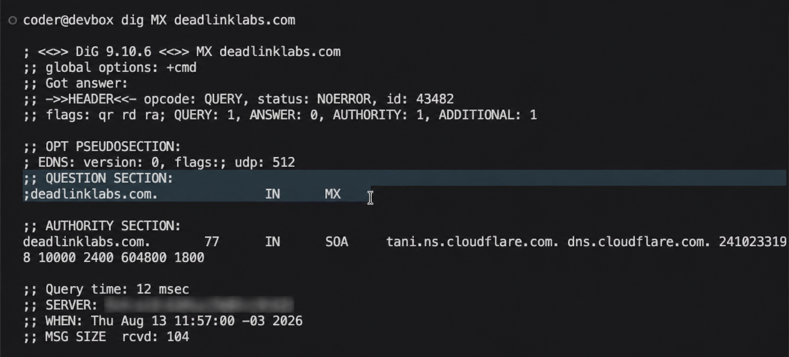

*The lookup worked. `ANSWER: 0` meant there was no MX record yet. Riveting television, but useful.*

==The MVP was finished at its own scope. Contact was the next build, not
something I forgot in the first one.==

## Two ways into the same inbox

There are two parts to this job.

The contact form needs to send through Resend. Regular email sent to
`hello@deadlinklabs.com` needs to come in through Cloudflare. Both end up in the
same inbox.

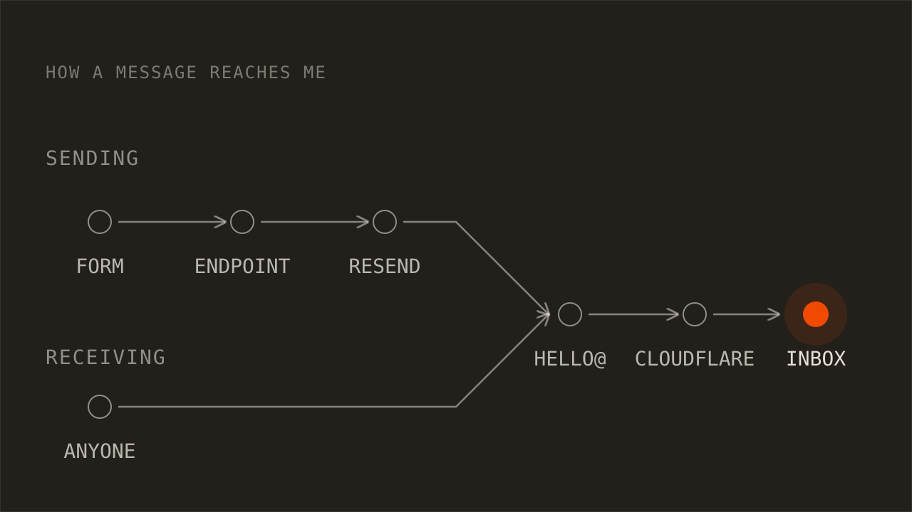

One door, two ways of knocking.

**That keeps my personal address out of the website and lets me change the
destination inbox without changing the code.**

## The first version didn't work

On August 11, I tried the obvious version: a handwritten API endpoint, a
thank-you page, and 103 lines of code behind a very small form.

It compiled. It didn't work end to end.

While debugging it, I found that Resend's Astro guide uses Astro Actions, which
covered most of the validation and request plumbing I'd written by hand. So I
deleted the first pass, put the form back to placeholder, and left the cleaner
rebuild for the camera.

AI helped write the first version quickly. Deciding that it wasn't worth
keeping was still my job.

Annoying, yes. Still better than keeping the wrong approach because I'd already
spent time on it.

==The first version failed, but it showed me what the second one didn't need.==

## The form shouldn't lie or eat the message

Testing the first version exposed two problems. A failed send could still look
successful, and an error sent the visitor back to an empty form.

Someone could write three paragraphs about their business, press the button,
hit an error, and lose the whole thing. That's a fairly rude way to introduce
yourself.

The rebuild fixes both. If a message doesn't go through, the form says so and
keeps everything the visitor typed. The API key stays on the server. The rest
belongs in the code.

The placeholder form also needed one more field: an email address. The original
layout collected a name, a company, and a problem, which was enough for the MVP.
A working contact form needs somewhere to send the reply.

The error message includes the direct `hello@` address too. If the form breaks,
there should still be another way through.

==Don't say "sent" when it wasn't, and don't make someone write the same
message twice.==

## Two services, one address

Cloudflare handles incoming mail. Resend handles messages sent by the website.

They can use the same domain without fighting over it because their DNS records
live in different places. Cloudflare uses the main domain. Resend uses a
separate `send.` address underneath it.

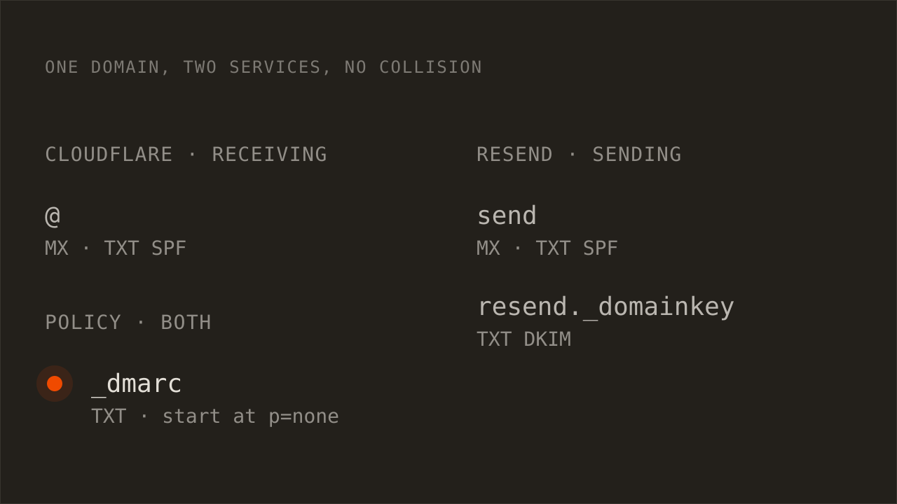

**That's the useful part of the DNS story: the two services share the domain
without sharing the same records.**

Cloudflare came first, on August 13. Email Routing on the domain was off:
zero rules, zero destinations, no DNS records.

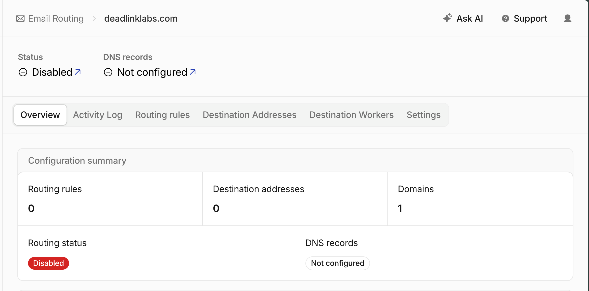

*The starting line. Nothing to forward, and nowhere to forward it.*

Step one is telling Cloudflare where mail should end up. I added my Gmail as a
destination address, and Cloudflare verified it in under a minute.

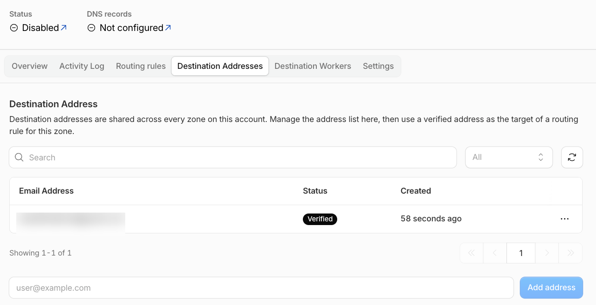

*One destination, verified in 58 seconds. It's the private inbox behind
everything, so it stays blurred.*

Cloudflare got two forwarding rules: one for `hello@` and one for DMARC reports.
The private destination addresses stay private.

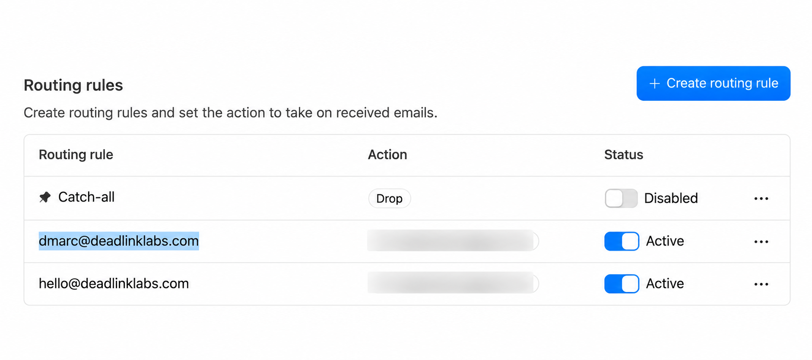

*Two public addresses, two active routes, one private inbox behind them.*

The catch-all in that table stays disabled on purpose. The moment a domain
accepts mail, scanners start guessing `admin@`, `info@`, `sales@`. With the
catch-all off, a wrong address bounces, and I only hear from the two addresses
I chose.

Two rules and one destination, and routing was still disabled. Rules say what
to do with mail once it arrives. DNS is what makes it arrive, and the domain
didn't have the records yet.

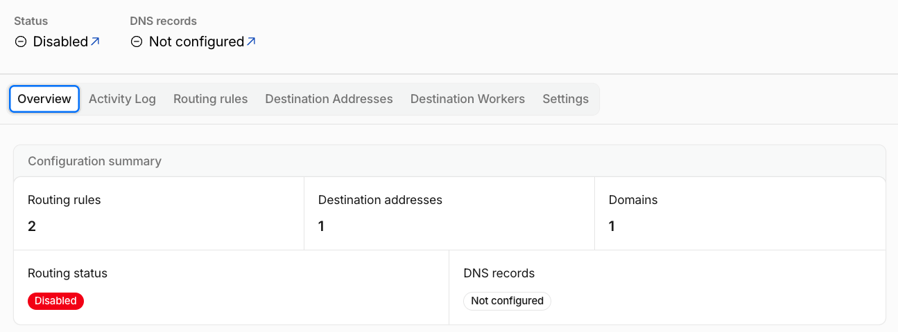

*Rules written, destination verified, still disabled. The missing piece was DNS.*

Cloudflare had already worked out the five records it needed. Three MX records
say "deliver this domain's mail here." One SPF record lists who is allowed to
send as the domain, and it has to be exactly one: a second SPF record on the
same name doesn't add to the first, it invalidates both. One DKIM key lets
forwarded mail carry a valid signature. All five showed as Missing, and one
button added them.

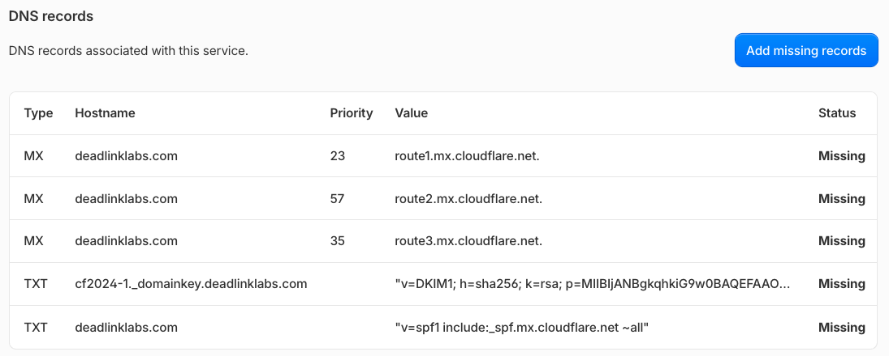

*The five records Email Routing needs, values already filled in. Add missing
records did the typing.*

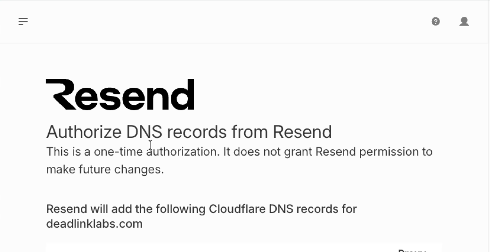

*Cloudflare's authorization page, from the recording. One-time, and nothing
after it.*

Resend came the next day. Receiving was one half. To send mail as
`deadlinklabs.com` and have other mail servers trust it, I needed a service
that signs what it sends. I added the domain in Resend and left the return
path at `send`, which is what puts Resend's records on `send.deadlinklabs.com`
instead of the root.

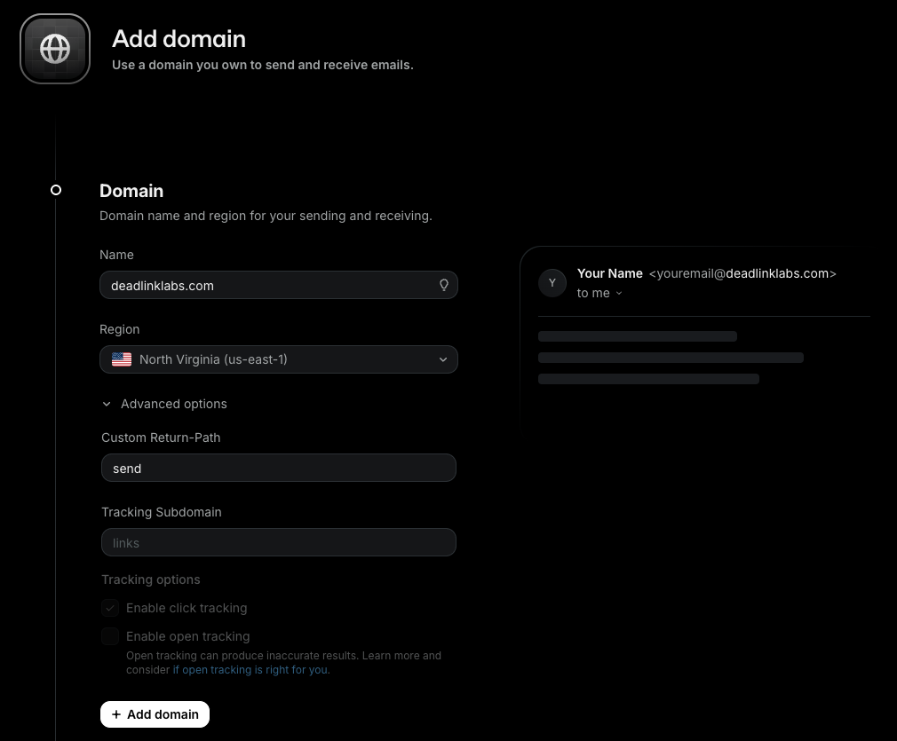

*Adding the domain in Resend. The return path is where the `send.` subdomain
comes from.*

Resend offers to write the DNS records itself if you let it sign in to
Cloudflare. That's a real permission grant, worth a second of thought, and the
page above is what it actually grants: one write, nothing after. It was my own
account on both sides, so I let it do the typing.

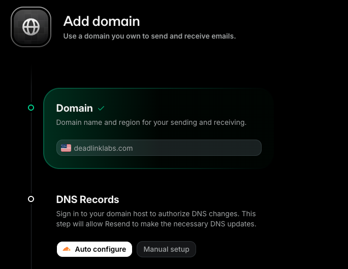

*Auto configure or paste the records by hand. Same records either way.*

Then the wait. Resend polls the domain until the records show up.

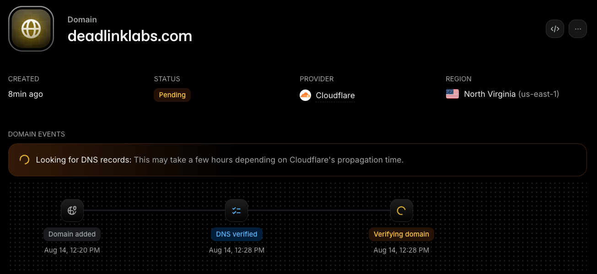

*Eight minutes in. DNS verified, domain still verifying, provider detected as
Cloudflare.*

Resend verified its side on August 14. The dashboard went from waiting for DNS
to a green “Domain verified” in ten minutes.

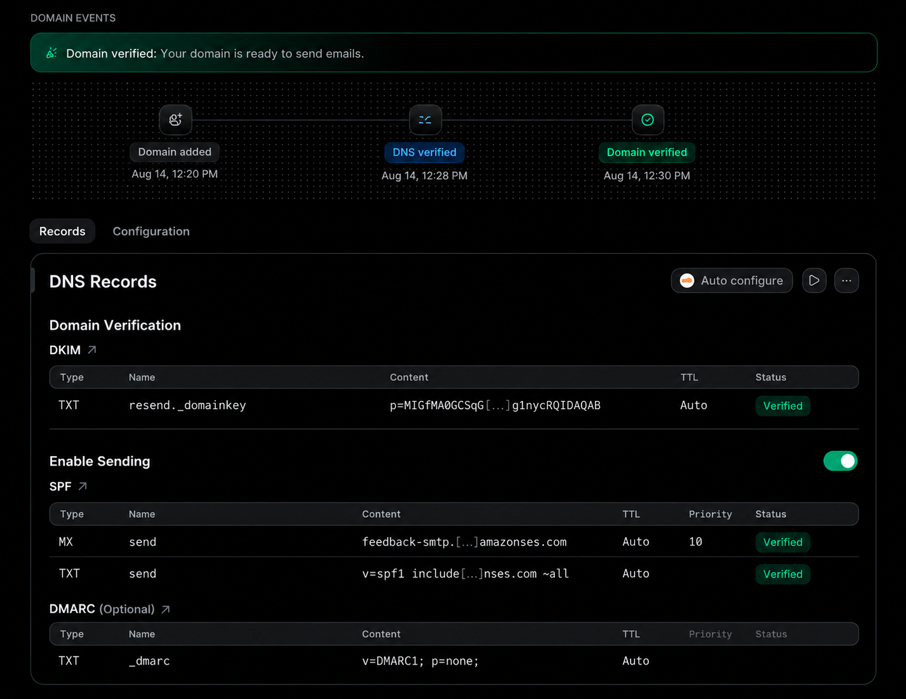

*Sending was configured. The website form still had to be finished.*

One toggle on that page stayed off: Enable Receiving. It would add Resend's
own MX record for incoming mail, and Cloudflare already has that job. Two
services answering the same question is the collision the `send.` subdomain
exists to avoid.

## One record across both

Auto configure didn't write the last record. Resend lists DMARC as optional
and only suggests a template, so I added it in Cloudflare by hand: a TXT
record named `_dmarc` with `v=DMARC1; p=none; rua=mailto:dmarc@deadlinklabs.com`.

DMARC is the record that ties SPF and DKIM together and says what to do with
mail that pretends to be from the domain. `p=none` means deliver everything
and send me a report. Nothing gets blocked while I find out whether the setup
is right. `rua` is where those reports go.

**The report address is on my own domain, not Gmail, and that's the part I
nearly got wrong.** A report address on a different domain needs that domain
to publish a record saying it accepts reports for mine. Gmail never will, so
most providers would quietly send nothing, and I'd spend a month wondering
why. Keep it on the domain and forward it, which is why `dmarc@` got a
routing rule in the first step.

*Every mail record on the domain, all DNS only. Cloudflare's proxy is for web
traffic, and a proxied mail record breaks mail.*

On September 15 I checked the whole receiving side from outside, with a public
resolver instead of my own machine's cache: the MX records, the SPF, the DMARC
record, and Resend's records on `send`. All five answers came back the way the
map above says they should. Then `dmarc@` got its own test message, since a
routing rule that's never carried mail proves nothing. It was in the inbox in
under a minute, and a message to an address I never created bounced with a
550, which is the catch-all doing its job.

*Five lookups against a public resolver on September 15. Nothing from my own
cache, and every record where the map says it is.*

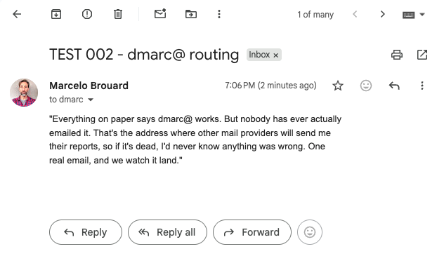

*`dmarc@` works too. TEST 002, sent on September 15, was in the inbox in under
a minute.*

## The first half is real now

Cloudflare doesn't provide another mailbox. It receives the mail and forwards
it into the Gmail inbox I already use.

With the five records in, the domain answers the question from the top of this
post. Same command, same day, three answers where there were none.

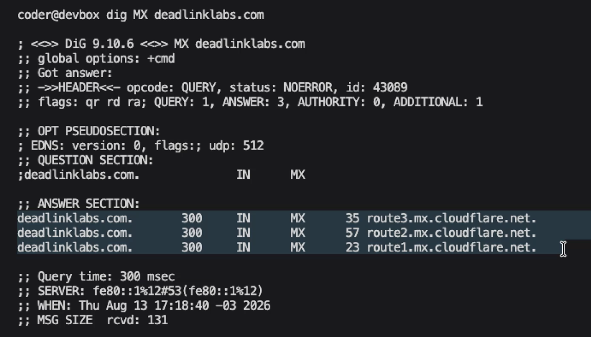

*`ANSWER: 3`. Same question as the first screenshot, five hours later.*

I sent a real test from my personal account to `hello@deadlinklabs.com` on
August 13.

It arrived.

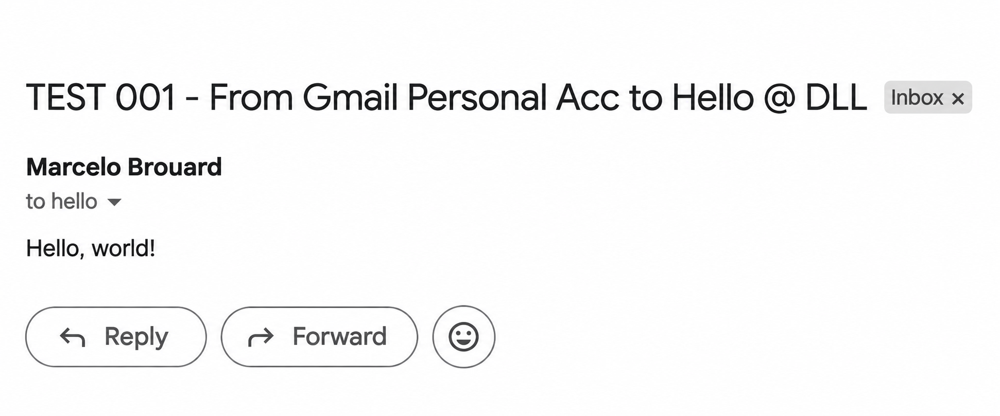

*The receiving path works. A real message sent to `hello@deadlinklabs.com`
reached my inbox.*

That screenshot proves receiving. It doesn't prove the website form yet, and it
doesn't prove that a reply can leave Gmail showing `hello@` instead of my
personal address. Gmail's “Send mail as” setting will handle that last part
through Resend, but it still needs the same treatment as everything else here: a
real test.

## Where this stands

The receiving side works. Resend has verified the domain for sending. The first
form implementation is preserved in Git history, including the version that
didn't work.

The form itself is currently back in placeholder state while I rebuild it with
Astro Actions. I still need to send a real message through the live website,
force a failure without losing the form, and reply from `hello@`.

Until those three things pass, this record stays `IN PROGRESS`.

**Done means a person can write once, press the button once, and get a real
answer.**

## Decisions on the record

- **01 · Keep the release boundary honest.** LOG 001 shipped the working MVP.
  Contact is the planned next layer.
- **02 · Use Resend for sending and Cloudflare for receiving.** Both paths meet
  at `hello@`.
- **03 · Keep the website static.** Only the contact form needs a server
  function.
- **04 · Replace the handwritten endpoint with an Astro Action.** Less code, one
  place for validation and errors.
- **05 · Never clear the form after a failed send.** The visitor's writing
  belongs to them.
- **06 · DMARC reports go to an address on the domain, never Gmail.** A report
  address off the domain gets silently ignored by most providers. `dmarc@`
  forwards like everything else.

## Log timeline

- [[building-deadlinklabs-with-ai-in-public]] (the MVP this work follows)

TAKEAWAY: LOG 001 got the website online. LOG 002 gives people a way to reach me
when they get there.
