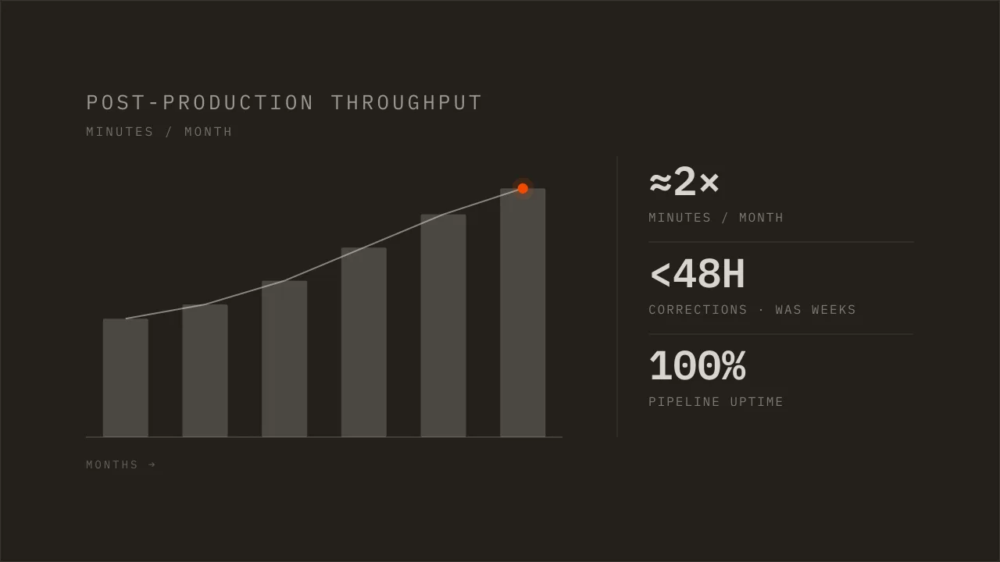

---
# --- Obsidian-internal (site ignores all of these) ---
type: work journal
created: 2026-07-18
project: "[[Crehana]]"
people: []

# --- web-* namespace (the ONLY fields the site reads) ---
web-status: published
web-title: "Crehana: automating an e-learning content operation"
web-pub-date: 2026-07-18
web-snippet: "Leading post-production at Crehana, a Latam e-learning startup: turning spreadsheets and manual QA into systems that cut costs and raised produced minutes."
web-type: log
web-number: 3
web-stage: SHIPPED
web-tags: [CASE-STUDY, AUTOMATION, DASHBOARDS, JIRA]
# web-video: "https://youtu.be/XXXXXXXXXXX"
web-thumb: "./assets/thumb.webp"   # on-brand pipeline tile (generated); source at assets/thumb.svg
---

For about two and a half years I ran post-production at Crehana, an online
education startup. The job was to get courses filmed, edited, corrected, and
launched. When I started, the operation ran on spreadsheets, manual handoffs, and
a Notion board nobody fully trusted. By the end, most of it ran on its own. This
is the top-level version of how, and the parts worth stealing.

```terminal
$ python production_plan.py
reading the board from Jira...
✓ 214 courses tracked · 0 stuck over 48h · plan posted
```

## The problem was invisible work

A content operation is a factory. Scripts come in, courses go out, and a lot of
small steps sit in between: assign an editor, submit for review, track a score,
chase a correction, launch. Every one of those steps lived in someone's head or in
a spreadsheet cell. Nobody could see the whole line at once, so nothing could be
fixed with any confidence.

TAKEAWAY: you cannot improve what you cannot see. Before automating anything, make
the work visible.

## Make the invisible visible

So the first thing I built was not automation. It was dashboards. Real-time views
in Looker Studio and Metabase that showed the whole pipeline: how many minutes were
in production, where courses were stuck, how long corrections took, how the budget
tracked against the plan.

Once the numbers were on a screen instead of in a rumor, the bottlenecks named
themselves.



*Recreated for this post. The growth ratios are faithful; the raw internal numbers are not shown.*

## One source of truth

Then I moved the whole workflow into Jira and made it the single place the work
lived. Production plan, backlog, documents, review, sourcing, production: each a
stage a course moved through, with an owner and a due date. The spreadsheets and
the stale Notion board went away.

That one change did more than any script. When every team reads the same board, the
meetings about who has what simply stop.

## Automate the parts that never change

With the work visible and in one place, the repetitive steps were easy to hand to
software. Assigning a reviewer by category. Submitting a course for review and
pulling it back. Tracking scores and launch progress. Notifying the next owner.
Sending the instructor their update. I wired these together with Jira, Python, and
Google Sheets.

The results were the kind you can measure. Post-production output went from about
500 minutes a month to over 1,000. Correction turnaround dropped from weeks to
under 48 hours. The pipeline held at full uptime. Throughput, counted in courses
out the door, rose about 80 percent.

## Cut what nobody opens

Some of the biggest wins were subtractions. I audited the tool stack and cancelled
what overlapped or went unused. Together with trimming other recurring waste, that
took more than $22,000 a year off the bill. Swapping a manual translation process
for an AI-assisted one saved another $10,000 and cut the turnaround at the same
time.

TAKEAWAY: an unused subscription is a standing invoice. Auditing the stack is some
of the cheapest money you will ever find.

## Then it scaled

Once the operation ran on systems instead of memory, it could grow without
breaking. We opened a Brazil operation and produced more than 200 courses in
Portuguese in a short window. Systems travel better than heroics. Working across
three languages helped, but the reason it held is that the process did not depend
on any one person knowing the trick.

## The decisions, on the record

| DEC | Decision | Status |
|---|---|---|
| DEC 001 | Dashboards before automation: make the pipeline visible first | SETTLED |
| DEC 002 | One source of truth in Jira; retire the spreadsheets and the Notion board | SETTLED |
| DEC 003 | Automate the repetitive review steps with Jira, Python, and Sheets | SETTLED |
| DEC 004 | Audit and cut redundant or unused subscriptions | SETTLED |
| DEC 005 | AI-assisted translation in place of a manual process | SETTLED |
| DEC 006 | Track every stage against an SLA, so accountability is built in | SETTLED |

## What carries over

None of this started as a strategy. It started with one spreadsheet I was tired of
updating by hand. That is usually where it starts.

If you run an operation that feels busy but blurry, the order matters more than the
tools. See it, centralize it, automate it, then cut what is left over. The stack
you pick barely matters. The sequence is the whole game.

Build to understand.
