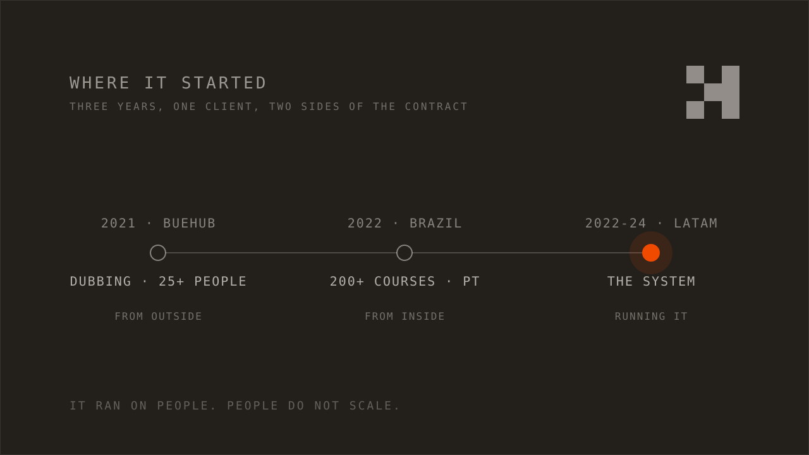
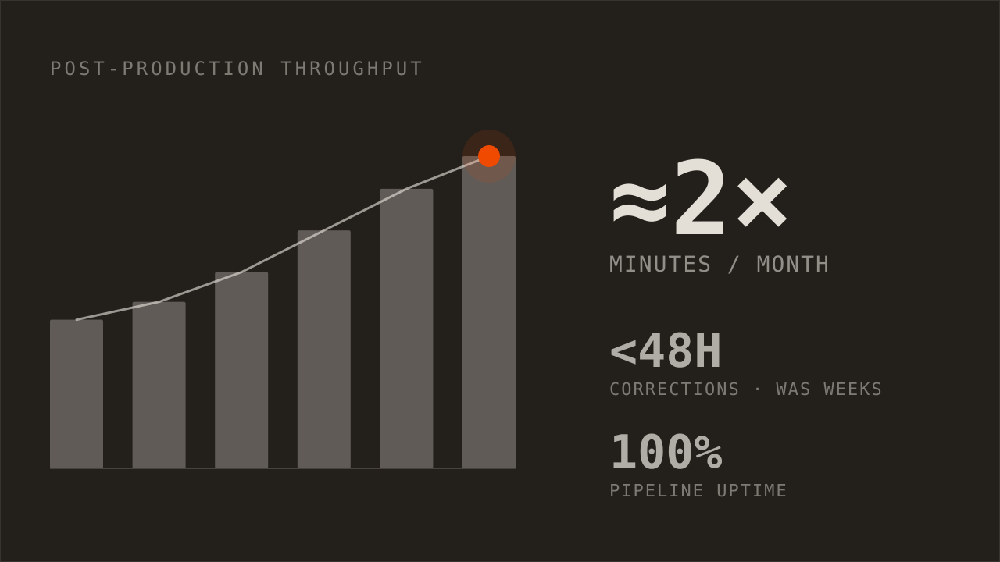
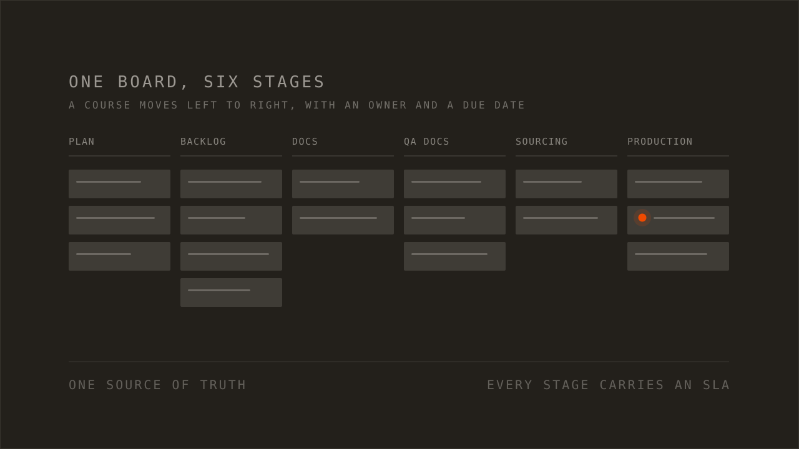
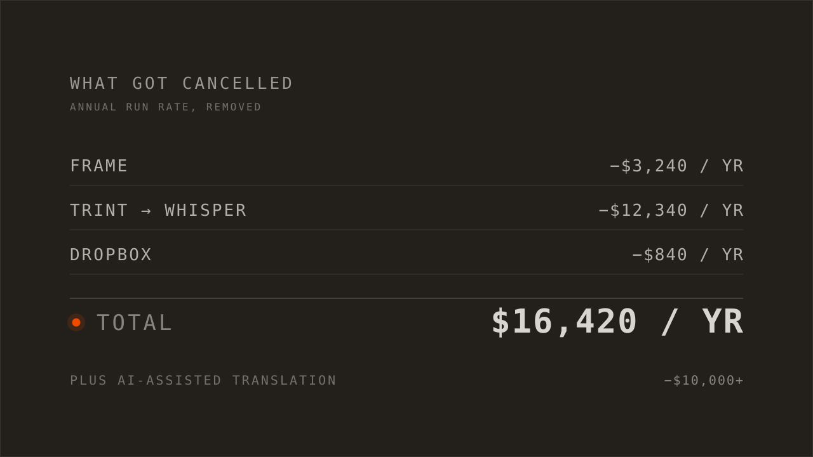
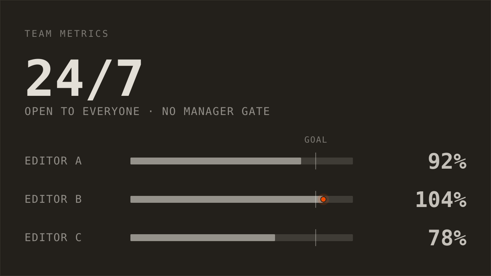

---
# --- Obsidian-internal (site ignores all of these) ---
type: work journal
created: 2026-07-18
project: "[[Crehana]]"
people: []
aliases:
  - "LOG 010"
  - "Crehana case study"

# --- web-* namespace (the ONLY fields the site reads) ---
web-status: published
web-title: "Crehana: automating an e-learning content operation"
web-pub-date: 2026-07-18
web-snippet: "Three years turning a content operation that ran on memory into one that ran on a system. Dashboards first, then one board, then automation, then the parts of the bill nobody was reading."
web-type: log
web-number: 10
web-stage: SHIPPED
web-tags: [CASE-STUDY, AUTOMATION, DASHBOARDS, JIRA]
# web-video: "https://youtu.be/XXXXXXXXXXX"
web-thumb: "./assets/thumb.webp"   # on-brand specimen tile (generated); source at assets/thumb.svg
---

When I arrived, nobody could tell me how many courses were in production. When I
left, a dashboard could, in real time, and so could everyone else.

That gap is the job. Crehana is an online education company in Latin America. I
spent about three years there, first from the outside and then running production,
turning a content operation that ran on memory into one that ran on a system.

The order was always the same. See it. Centralize it. Automate it. Then cut what is
left over. The stack barely matters. The sequence is the whole game.

```terminal
$ python production_plan.py
reading the board from Jira...
✓ 214 courses tracked · 0 stuck over 48h · plan posted
```

## Where it started

I did not start inside Crehana. In 2021 I came in from the outside, contracted
through BueHub to launch their dubbing division. That meant hiring and running a
remote team of more than 25 people across Argentina and Brazil, working in Spanish,
Portuguese, and English.

It worked, so it turned into the next thing. In 2022 I led the Brazil launch, this
time from inside the company: more than 200 courses produced in Portuguese in about
six months.

Both of those ran on people. Long hours, tight coordination, and somebody always
holding the whole picture in their head. That is the part worth being honest about.
It worked, and it did not scale. You cannot hire your way out of a process problem
forever.



TAKEAWAY: heroics are a real strategy for about six months. After that they are a
liability, because the operation now depends on the people who can perform them.

## See it

The first thing I built was not automation. It was dashboards.

Real-time views in Looker Studio and Metabase across the whole pipeline: how many
minutes were in production, where courses were stuck, how long corrections took,
how the budget tracked against the plan. Before that, the answer to most questions
was a guess delivered in a confident voice.

Once the numbers were on a screen instead of in a rumor, the bottlenecks named
themselves. Nobody had to be talked into believing that corrections were the
problem. You could see that corrections were the problem.



*Recreated for this post. The growth ratios are faithful; Crehana's raw internal numbers are not shown.*

TAKEAWAY: you cannot improve what you cannot see. Build the instrument before you
touch the engine.

## Centralize it

Then I moved the whole workflow into Jira and made it the only place the work
lived. Production plan, backlog, documents, QA documents, sourcing, production.
Each one a stage a course moves through, with an owner and a due date. The
spreadsheets went away, and so did a Notion board that had quietly stopped being
true months earlier.

That one change did more than any script I wrote. When every team reads the same
board, the meetings about who has what stop happening.

It also made the SLAs possible. Once a stage has an owner and a date, you can say
what late means, and the board can say it instead of a person.



## Automate it

With the work visible and in one place, the repetitive steps were easy to hand to
software. Jira, Python, and Google Sheets did nearly all of it.

- Assign a reviewer by category.
- Submit a course for review, and pull it back when the review is done.
- Track scores and launch progress.
- Publish the upcoming launch calendar straight off the board, instead of someone
  rebuilding it by hand every week.
- Notify the next owner. Send the instructor their update.
- Break down cost per course, so the numbers arrived without anyone assembling
  them.

The results were the kind you can measure. Post-production output went from about
500 minutes a month to over 1,000. Correction turnaround dropped from weeks to
under 48 hours. The pipeline held at full uptime. Throughput, counted in courses
out the door, rose about 80 percent.

One honest note. That automation meant a role we had been staffing stopped being
necessary. That is the part of this work nobody puts on a slide, and it is worth
saying out loud.

```terminal
$ jira-automation --status
qa queue      · auto-assigned by category
corrections   · 0 open past sla
launch feed   · published from the board
```

## Cut what is left over

Some of the largest wins were subtractions.

I audited the tool stack and cancelled what overlapped or went unused. Frame came
off the bill at $3,240 a year. Trint was replaced by Whisper, which did the same
job for the cost of running it, at $12,340 a year. A Dropbox cleanup took off
another $840. That is $16,420 a year in tools nobody missed.

Replacing a manual translation process with an AI-assisted one saved another
$10,000 and cut the turnaround at the same time. Add the efficiency savings in
review time and production minutes, and the number I handed over when I left was
more than $22,000 a year.



TAKEAWAY: an unused subscription is a standing invoice. Auditing the stack is some
of the cheapest money you will ever find.

## What the team got

This is the part I care about most, and it is the easiest part to fake, so here is
what actually changed.

**People got their time back.** The manual reporting work, cost analysis per
course, the launch calendar, the QA scoring reports, had been somebody's week.
Afterwards it was a dashboard that updated itself, and those people spent the week
on work that needed a person.

**The chasing stopped.** Corrections used to sit for weeks while someone followed
up. Once every stage carried an SLA, the system did the following up. That removed
a whole category of friction, because "where is my correction" stopped being a
conversation between two colleagues.

**Nobody waited to find out where they stood.** Team metrics and OKRs were open to
everyone, all the time, not gated behind a manager or a weekly meeting. Workload
distribution became something you could look at instead of argue about.

**The work became predictable.** How booked the studios were, and what was coming
next, stopped being a surprise, so planning replaced firefighting.



*Recreated for this post. The shape is faithful; the labels are roles rather than people, and the figures are not Crehana's real per-person output.*

## The decisions, on the record

| DEC | Decision | Status |
|---|---|---|
| DEC 001 | Dashboards before automation: make the pipeline visible first | SETTLED |
| DEC 002 | One source of truth in Jira; retire the spreadsheets and the Notion board | SETTLED |
| DEC 003 | Automate the repetitive review steps with Jira, Python, and Sheets | SETTLED |
| DEC 004 | Every stage carries a tracked SLA, so the system chases instead of a manager | SETTLED |
| DEC 005 | Team metrics and OKRs open to everyone, 24/7, not manager-gated | SETTLED |
| DEC 006 | Publish the launch calendar from the board, never maintain it by hand | SETTLED |
| DEC 007 | Audit and cut redundant or unused subscriptions | SETTLED |
| DEC 008 | AI-assisted translation in place of a manual process | SETTLED |

## What carries over

None of this started as a strategy. It started with one spreadsheet I was tired of
updating by hand. That is usually where it starts.

If you run an operation that feels busy but blurry, the order matters more than the
tools. See it, centralize it, automate it, then cut what is left over. Run that
backwards and you automate a process nobody understands, on a stack nobody agreed
to.

The tools are replaceable. Every one of them. The sequence is not.

Build to understand.
