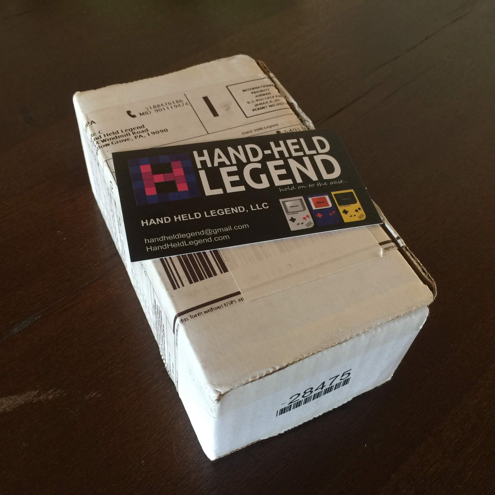
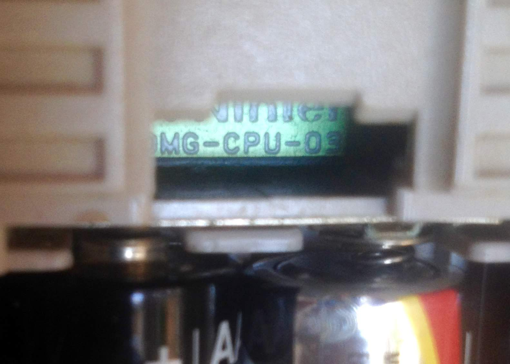
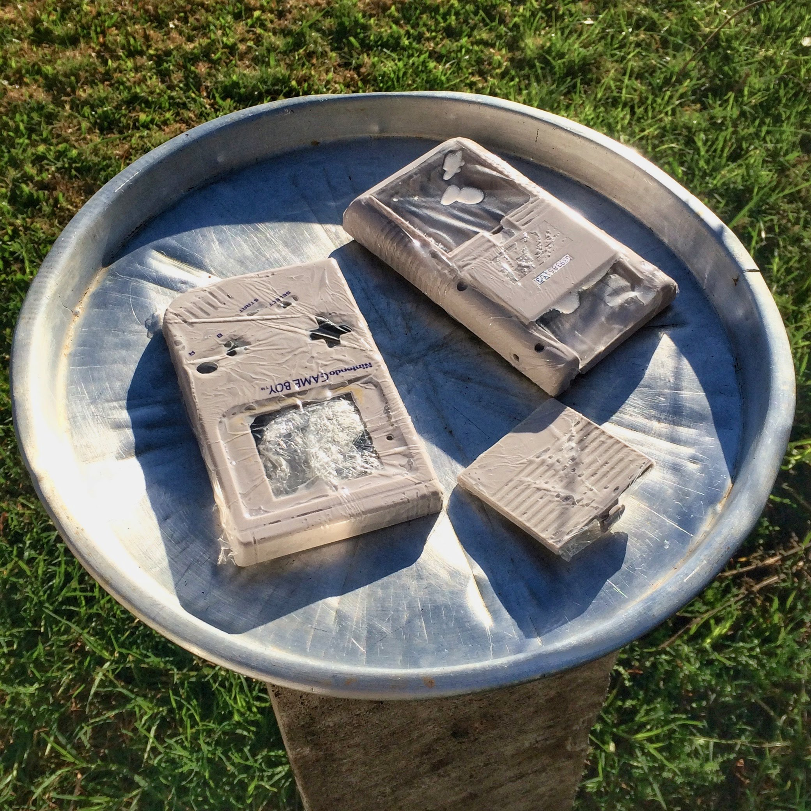
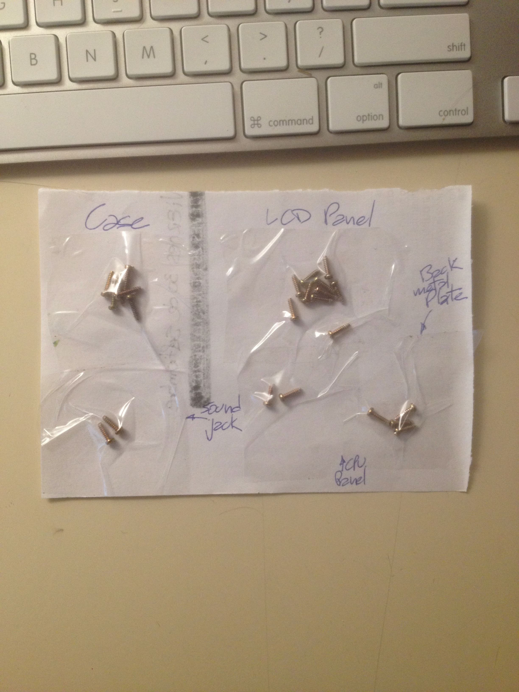
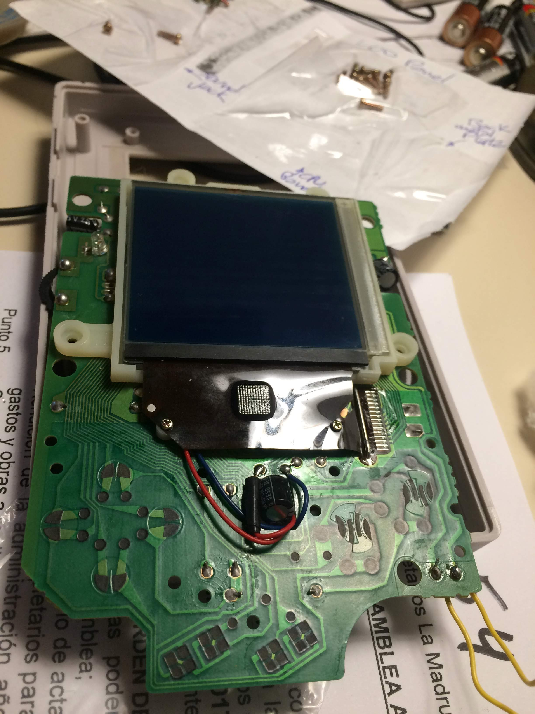
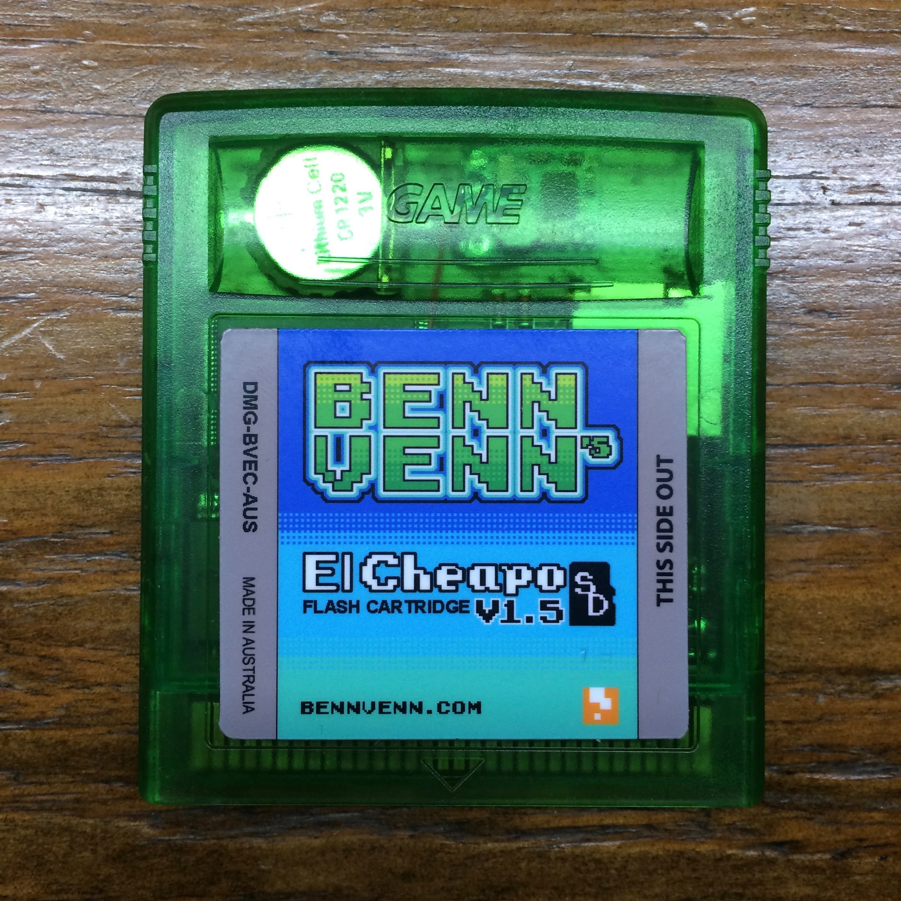
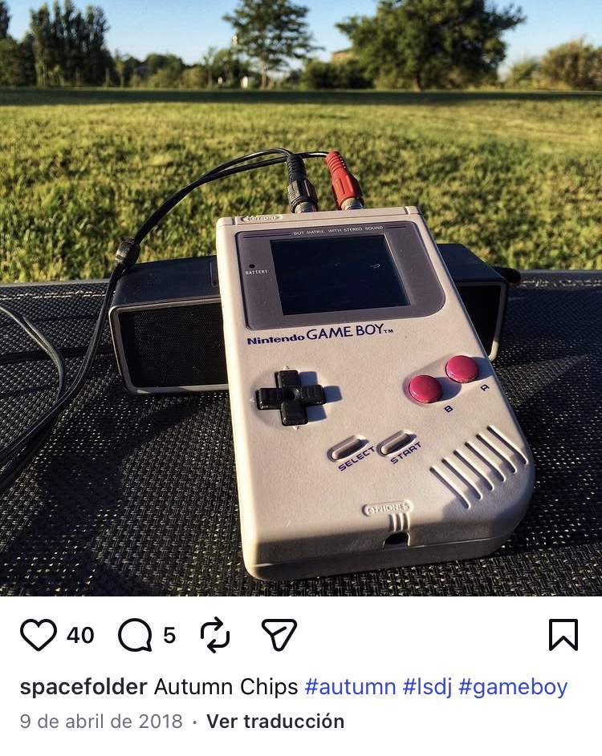

---
# =========================================================================
# DRAFT B — the chronological build log.
# ALTERNATIVE to the live post one folder up ("The Game Boy I was allowed
# to break.md"), which runs the reversibility spine instead. Same facts,
# same photographs, different argument. Pick one; the other gets deleted.
#
# This folder is four levels deep, so the content loader's `*/*/*.md` glob
# never sees it and it cannot collide with the real post's slug.
# To promote this draft: move it up one level, delete the other .md,
# set web-status to published.
# =========================================================================
type: work journal
created: 2026-08-23
project: "[[DMG chiptune machine]]"
people: []
aliases:
  - "LOG 015"
  - "THROWBACK 002"

web-status: draft
web-title: "Four mods, one Game Boy: retrobrite, backlight, bivert, pro sound"
web-pub-date: 2026-08-23
web-snippet: "A 1989 handheld, a box of parts that took four months to arrive, and one week in July where it all came apart on a desk and went back together as an instrument."
web-type: log
web-number: 15
web-stage: SHIPPED
web-tags: [HARDWARE, CHIPTUNE, SOLDERING, LSDJ]
web-series: THROWBACK
web-series-number: 2
web-thumb: "./assets/dmg-2017-retrobrite-before-after-thumb.webp"
web-thumb-alt: "Two original Game Boys side by side on a wooden table. The one on the left is deeply yellowed, almost mustard, with a scratched screen lens. The one on the right is pale grey and clean, its screen bezel empty because the console is still in pieces."
web-thumb-caption: "Left, my own Game Boy, untouched since I was eleven. Right, the donor's front shell after seven hours of winter sun. Same plastic, same age, one afternoon of chemistry between them."
---

In July 2017 I spent a week turning an original Game Boy into something you could
plug into a mixer. Four mods, in this order: retrobrite the shell, replace the
button pads, backlight the screen, invert the picture, and tap the audio ahead of
the amplifier.

The goal was LSDj, a music tracker that runs on the Game Boy itself. I wanted to
write chiptunes on the actual hardware, and I wanted to be able to record the
result without the hiss the machine ships with.

Everything below has been done by other people and written up better. I'm
recording it because it happened, because I still have the photographs, and
because the machine is still in a drawer and still works.

## The parts, and the four months they took

Hand Held Legend, Willow Grove, Pennsylvania. Order 9296, shipped October 3rd,
2016:

- **Silicone button pads.** The rubber under the buttons goes hard and stops
  making contact.
- **Backlight, version 2, white.** For the DMG and the Pocket.
- **Bivert module.** More on this below. It's the interesting one.
- **Replacement grey glass screen lens.** The original was scratched.
- **Tri-wing screwdriver.** Nintendo used an unusual screw head specifically so
  you wouldn't open the case.

*The box, photographed the day it landed. February 3rd, 2017. Four months in
transit, which is what ordering hobby electronics into Argentina looked like.*

Then it sat in a drawer for another five months. The parts landed in February and
I opened the box for real at the end of June. ==The honest shape of this project
is four months of shipping, five months of nothing, and one week where I did all
of it at once.==

## The donor, and why it isn't my Game Boy

I have two. Both are model DMG-01, because every original Game Boy is a DMG-01.
What differs is the board inside, and there are eight CPU revisions.

The yellowed one in the photograph at the top is mine from when I was eleven. It
has never been opened and it isn't going to be. The other one I bought
secondhand, to take apart.

Before ordering anything I read the donor's board revision through the battery
window in the back, without opening it.

*DMG-CPU-03. You can read the revision without a screwdriver, which is worth
knowing before you buy one of these for a specific purpose.*

For music that's a relevant number. The chiptune consensus is to use CPU-04
through 08 for LSDj and skip the first three, and the complaint about the 02 and
03 boards is sample playback on the wave channel. To be precise: these are
different analog characteristics, not defects. LSDj runs fine on a 03 and plenty
of people use them. It just isn't the board anyone recommends when music is the
whole point.

I knew the revisions differed and I checked before spending the money, which is
why that photograph exists. Whether I understood at the time exactly what a
CPU-03 does to sample playback, I honestly can't tell you nine years later, and
I'd rather leave the gap visible than invent the version where I knew.

%%MARCELO: same open beat as in the live draft. If you DID know the CPU-03
wave-channel advice up front, replace the paragraph above and flip DEC 010 to
SETTLED. This comment is stripped by remark-obsidian.mjs and never reaches the
page.%%

## Mod one: retrobrite

Thirty years of daylight turns these shells mustard. It isn't dirt and it doesn't
wash off.

The plastic is ABS, and ABS from that era carries brominated flame retardants.
Ultraviolet light breaks those down, bromine comes loose, finds oxygen, and the
compound it forms is yellow. The colour is a chemical change in the material.

Retrobrite reverses it with hydrogen peroxide and more ultraviolet light. The
peroxide oxidises the free bromine back to something colourless and the sunlight
drives the reaction. I used salon developer cream, which is peroxide thick enough
to stay where you paint it, wrapped every piece in stretch film so it wouldn't
dry out, and put the lot in a metal tray in the garden.

*Half past nine in the morning, Sunday July 2nd, 2017. Front shell, back shell,
battery cover.*

I moved the tray around the garden all day chasing the sun, roughly seven hours,
on a cold clear Buenos Aires winter day. The result is the photograph at the top
of this post, taken that evening.

**One caveat, because leaving it out would oversell the result.** Retrobrite is a
surface treatment. The yellow compounds sit all the way through the plastic and
what comes off the outside eventually works its way back. It also does the
material no favours. Eight years on this shell has held up. It won't hold up
forever.

## Mod two: button pads, and a map of every screw

A Game Boy has screws in four lengths and they aren't interchangeable. A long one
in a short hole presses into the board. A short one in a case post means the shell
never closes right again.

So before removing a single screw I drew a map: one sheet of paper, four zones
in ballpoint, each group taped down under packing tape as it came out.

*Case, LCD panel, sound jack, back metal plate. Ten minutes at the start, and the
reason reassembly took twenty minutes instead of a whole evening.*

The button pads themselves are the easiest job in the box. Undo the board, lift
out the old silicone, drop in the new.

I did them first on purpose, and not because they were next in any guide.
Fitting them meant reconnecting the board and switching the console on, which
answered the only question that mattered before the screen work started: does
this secondhand Game Boy, bought from a stranger and now in pieces, still boot.

==It booted, and that told me for the price of a set of button pads whether there
was any point attempting the step that can't be undone.==

TAKEAWAY: before an irreversible step, find the cheapest reversible thing that
proves the expensive one is worth attempting.

## Mod three: the backlight, and the film that has to come off

This is the step that ends projects.

To light a DMG screen from behind you have to remove the reflective polarising
film glued to the back of the LCD, because the backlight goes exactly where the
reflector currently is. The glue is thirty years old and how it behaves varies
from unit to unit.

The screen is a bare sheet of glass with a ribbon cable bonded along one edge.
Bend it and it snaps. Press too hard with a blade and you scratch it or cut the
ribbon. There is no repair. When someone says a Game Boy backlight mod went
wrong, this is nearly always the step.

You can buy a replacement LCD. I didn't want one, because the reason to do this
to a thirty-year-old console instead of buying a modern reproduction is that it
stays the original machine.

A fresh blade almost flat, a cotton swab, and about an hour of lifting one corner
and working across in small movements.

*Half past eleven at night, July 7th. The grey sheet at the right is the film,
off in one piece. That's the whole toolkit next to it.*

I took that photograph because the project had just gone from "might end in a bin
bag" to "is going to happen", and I wanted the receipt.

The backlight panel then sits where the reflector was, and its power comes off a
DC line already on the board.

*Backlight power tapped off the board. The screen reads solid navy here because
the reflector is gone and the film is not back on yet.*

## Mod four: the bivert, or why you invert the picture twice

Here's the one that isn't obvious, and it's my favourite part of the whole build.

A backlight on its own makes a DMG screen brighter and worse. The display is dark
pixels on a pale reflector, so lighting it from behind lights the background just
as much as the pixels. Contrast collapses and the image washes out.

The fix is to invert the picture, so you get bright pixels on a dark field, which
is what a backlit display wants. And you do it twice.

**The first inversion is electrical.** The bivert module is a 74HC04 hex inverter
on a small carrier. You lift two pins on the LCD ribbon connector, seat the chip
underneath them, solder them to the carrier and run a wire to ground. Every pixel
that was on is now off.

**The second inversion is optical, and it's free.** The polarising film you just
spent an hour removing goes back on the front of the screen, rotated ninety
degrees. Turning a polariser through a right angle flips the image again.

Two inversions put the picture back the right way round, except that the pixels
and the background have swapped places on the way. The result has more contrast
than the console had before anyone touched it.

*A quarter to eleven at night, July 8th. Backlit, inverted, Tetris running, case
still open. The printed sheet under the board is the kit's own instructions.*

## Mod five: pro sound, which was the actual point

An unmodified Game Boy has one audio output, the headphone jack, sitting after
the internal amplifier and the volume wheel. That amplifier is noisy. It was
designed in 1989 to drive a small speaker for a child and it does that job fine.
It is useless for recording.

The pro sound mod, published years ago by the chiptune musician Trash80, taps the
stereo signal earlier, ahead of the amplifier and the volume pot, and brings it
out on its own connectors. You give up volume control on that output and you get
a clean line-level signal that goes straight into a mixer or an interface.

I drilled the top of the shell for two RCA jacks and wired them to the tap.

==Every other mod in this post was so I could see the screen. This one was the
reason the console was on the desk at all.==

*The bench at ten past eight that night. The shell on the paper towel already has
its two RCA holes drilled. The laptop is running SETI at home on a recording from
Arecibo, which had been chewing through radio telescope data on my machines for
years, because of Carl Sagan and Cosmos.*

## Back together

The screws came off the map in reverse order and the shell closed once.

*Twenty to one in the morning, July 9th, 2017. Super Mario Land 2, on a console
cleaner than the day it was sold.*

The software took longer. LSDj is a tracker written by Johan Kotlinski in 2000
and still maintained by him now, and running it needs a cartridge you can write
to. Mine is a BennVenn El Cheapo, a flash cart with a microSD slot, made in
Australia. It turned up on August 2nd, three and a half weeks after the build.

*A microSD goes in the top, the ROM goes on the card, and the Game Boy has no
idea it isn't a normal cartridge.*

I remembered finishing the console and writing my first tracks on it the next
day. The photographs say otherwise. The first picture of this machine actually
being used as an instrument is April 9th, 2018, nine months later, out in a field
with the RCA cables running into a battery speaker.

*April 9th, 2018. Nine months on, still being used for the thing it was built
for. I'll take that over the tidier version I remembered.*

## The decisions, on the record

| DEC | Decision | Status |
|---|---|---|
| DEC 001 | Salon developer cream over liquid peroxide, so it stays where it's painted | SETTLED |
| DEC 002 | Stretch film over every retrobrited piece, to stop the cream drying out | SETTLED |
| DEC 003 | Direct sunlight over a UV lamp. Seven hours on a clear winter day was enough | SETTLED |
| DEC 004 | Screws mapped and taped by zone on a paper sheet before disassembly | SETTLED |
| DEC 005 | Button pads fitted first, as a boot test before any screen work | SETTLED |
| DEC 006 | Original polarising film peeled by hand rather than a replacement LCD bought | SETTLED |
| DEC 007 | Bivert fitted alongside the backlight. A backlight alone is worse than stock | SETTLED |
| DEC 008 | Film refitted rotated 90 degrees, for the second, free inversion | SETTLED |
| DEC 009 | Audio tapped ahead of the amp and volume pot, out to two RCA jacks | SETTLED |
| DEC 010 | Built on a DMG-CPU-03 rather than holding out for an 04 or later | REVISED |

DEC 010 is the one I'd change. The board works and I've written music on it, but
it's the revision the chiptune scene tells you to skip for exactly this use, and
holding out for a later one would have cost nothing.

## What it's worth

I didn't invent any of this. The chemistry is somebody else's, the bivert shipped
with printed instructions, and the audio tap is a mod with a hundred write-ups.
Hand the same box of parts to anybody patient and they'd get the same machine.

What the week actually required was doing things in an order that kept the
expensive mistakes cheap: prove the board boots before touching the screen, label
what you take apart while you still know what it is, and test with the case open
so you only close it once.

The Game Boy is still in a drawer. It still works, and the yellow one is still
sitting next to it, untouched.
