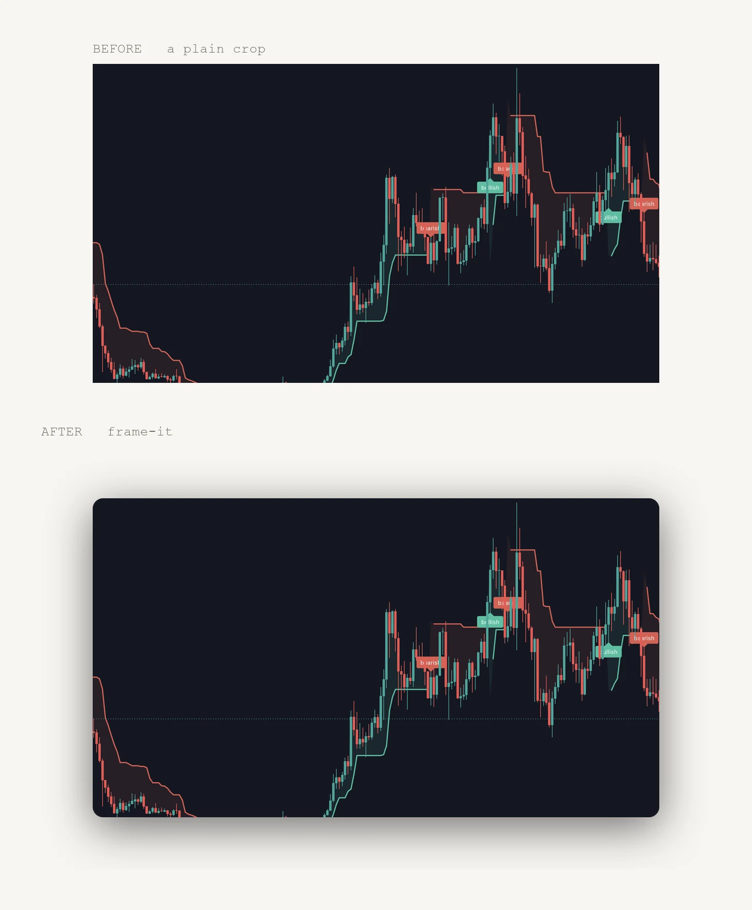

<!--
  DRAFT. Written 2026-09-20 from the session that built the tool.
  Open questions for Marcelo:
  - Title set by Marcelo 2026-09-20, keeping the exclamation mark. That
    overrides VOICE-POSTS §1 ("no exclamation marks, ever") on purpose, for
    this title only. It is not a precedent for the body copy.
    The .md filename says "the terminal", the title says "my terminal", as
    specified. The folder, and so the URL, is unchanged.
  - Repo is public: github.com/deadlink-labs/skills. The post links the full
    script and says the block shown is condensed.
  - Images: before-after is the demo. If you want a third, the honest one is a
    real screenshot of the folder run in your own terminal.
-->

Every screenshot I put on this site used to arrive looking slightly wrong, and it took me a while to work out why. Not the content. The edges. A picture of a window sits on the page like an object, and a picture of *part* of a window sits on it like a sticker.



*Same pixels, same crop. The only difference is what's around them.*

## The gap macOS leaves

If you press Cmd+Shift+4 and then Space, macOS captures a whole window and hands you rounded corners and a soft shadow, free. Drag a selection instead and you get a hard rectangle. Same key, same session, two completely different objects.

==macOS only gives you the shadow when you capture a whole window, and almost nothing I publish is a whole window.== It's a crop of a chart, a slice of a dashboard, a panel out of a full screen grab. So I'd been publishing the sticker version for months, and fixing it by hand in an image editor when I noticed, which is to say rarely.

The fix is not complicated. Round the corners, blur a dark copy of the shape, offset it down, keep the margins transparent so it composites onto whatever colour the page happens to be. That's the whole idea.

## The part that actually matters

Twelve lines do the work. Everything else in the script is argument parsing and file handling, so what follows is condensed: the real function takes a couple more arguments and carries its docstring. The [full script is on GitHub](https://github.com/deadlink-labs/skills/blob/main/claude/frame-screenshot/scripts/frame_shot.py), about 200 lines with the clipboard and folder handling attached.

```python
def frame(im, radius, blur, offset, alpha):
    w, h = im.size
    pad = blur * 2 + abs(offset)

    # The corner mask, drawn at 4x and downsampled. Pillow's rounded_rectangle
    # aliases badly at 1x and the jaggies show against a light page.
    big = Image.new("L", (w * 4, h * 4), 0)
    ImageDraw.Draw(big).rounded_rectangle((0, 0, w * 4 - 1, h * 4 - 1),
                                          radius=radius * 4, fill=255)
    mask = big.resize((w, h), Image.LANCZOS)

    # The shadow: the same silhouette, blurred, nudged downwards.
    shadow = Image.new("RGBA", (w + 2 * pad, h + 2 * pad), (0, 0, 0, 0))
    sil = Image.new("RGBA", (w, h), (0, 0, 0, round(255 * alpha)))
    shadow.paste(sil, (pad, pad + offset), mask)
    shadow = shadow.filter(ImageFilter.GaussianBlur(blur))

    shadow.paste(im.convert("RGBA"), (pad, pad), mask)
    return shadow
```

Two details are load bearing. The mask gets drawn four times too big and scaled down, because Pillow's rounded corners alias at full size and you can see the stair steps against a pale background. And the canvas grows by twice the blur on every side, so the shadow's falloff never gets clipped at the edge of the file.

The defaults scale with the image. A retina capture gets 24 pixel corners and a 48 pixel blur. A small one gets half that, because the same numbers on a 900 pixel wide image look like a cartoon.

## Then I gave it a name

A script in a folder is something you have to remember the path to. I'd used it twice and then forgotten where it lived.

```bash
frame-it() {
  local s=~/.claude/skills/frame-screenshot/scripts/frame_shot.py
  if [ $# -eq 0 ]; then python3 "$s" -c; else python3 "$s" "$@"; fi
}
```

With no arguments it reads the image off the clipboard, frames it, and puts the result back on the clipboard. So the loop is: Cmd+Ctrl+Shift+4 to shoot straight to the clipboard, type `frame-it`, paste wherever it was going. No file, no path, no filename to invent.

==A tool you have to remember the path to is a tool you stop using, and the fix was a name rather than a feature.== It went from twice to a dozen times a day on the strength of being one word.

## The folder, and the bug that took two runs to see

A blog post is rarely one screenshot. Point it at a folder and it frames everything in there, in place, writing `diagram_fi.png` next to `diagram.png` and leaving the original alone.

```terminal
$ frame-it ./content/log/2026/my-post/assets
  step-one.png -> step-one_fi.png 1840x1140 @2x, step-one_fi.webp 40KB
  step two.jpg -> step two_fi.png 1520x920 @1x, step two_fi.webp 21KB
  final-result.webp -> final-result_fi.png 1320x720 @1x, final-result_fi.webp 10KB
```

The point is being able to run it again after adding three more crops. So the first version skipped any file whose name already ended in `_fi`, which sounds like the same thing and isn't.

==Skipping the files named `_fi` is not the same as skipping the files that already have one.== The originals are still sitting there, still unframed by their own name, so run two cheerfully reprocessed the entire post. It has to check for the twin, not the suffix. Now a second run says "nothing to do: 12 already framed", and adding one new crop processes exactly one new crop.

TAKEAWAY: "already done" is a property of the output, not the input. Anything that re-runs over a folder has this bug available to it.

## Where the code lives

[github.com/deadlink-labs/skills](https://github.com/deadlink-labs/skills). Three files: a README, a `SKILL.md`, and the Python with its argument parsing attached. Clone it, symlink the folder into `~/.claude/skills/`, add the shell function, and it works on any Mac with Pillow installed.

It's packaged as a skill for Claude Code rather than a lone script, which means I can also just say "frame these" inside any project and it knows what that means and where the tool is. The terminal keeps the verb. The assistant gets the same one.

The whole thing was built with Claude Code in a single working session, which is how most of the small tools here get made now. AI-assisted development is good at exactly this shape of job: narrow, well defined, and annoying on a daily basis without ever quite clearing the bar for opening an editor on a Saturday. The tools that used to die as a note that said *would be nice* now get built the afternoon I notice them.

## Decision Register

| DEC | Decision | Status |
|---|---|---|
| DEC 001 | Pad to an aspect ratio, never crop to it. The first version trimmed to 16:9 and cut a legend off the edge | SETTLED |
| DEC 002 | Skip a source when its framed twin exists, not when its own name ends in `_fi` | SETTLED |
| DEC 003 | Clipboard in and clipboard out as the default with no arguments, because the fastest path has no filename in it | SETTLED |
| DEC 004 | Ship it as a Claude Code skill plus a shell function, so the same tool answers to a command and to a sentence | SETTLED |
| DEC 005 | Publish the repo, so the post links the real script instead of describing it | SETTLED |

It's a small thing. It also means every screenshot I publish from here on sits on the page instead of on top of it, and I stopped thinking about it entirely, which is the actual goal.
