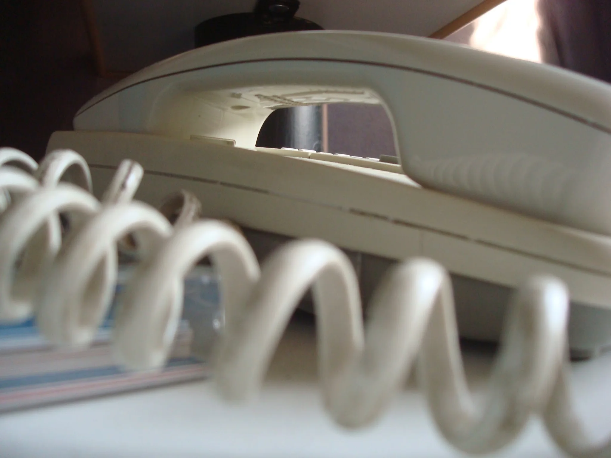
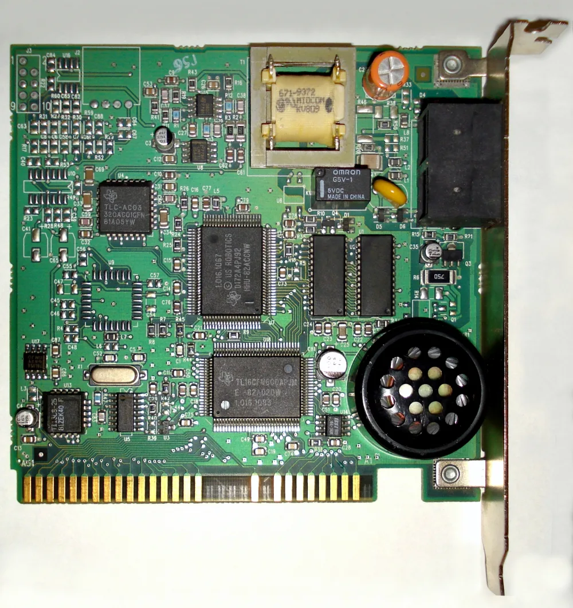
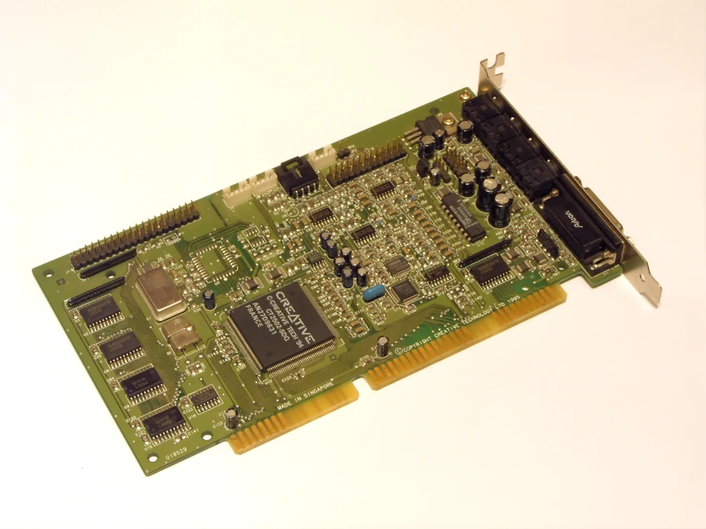
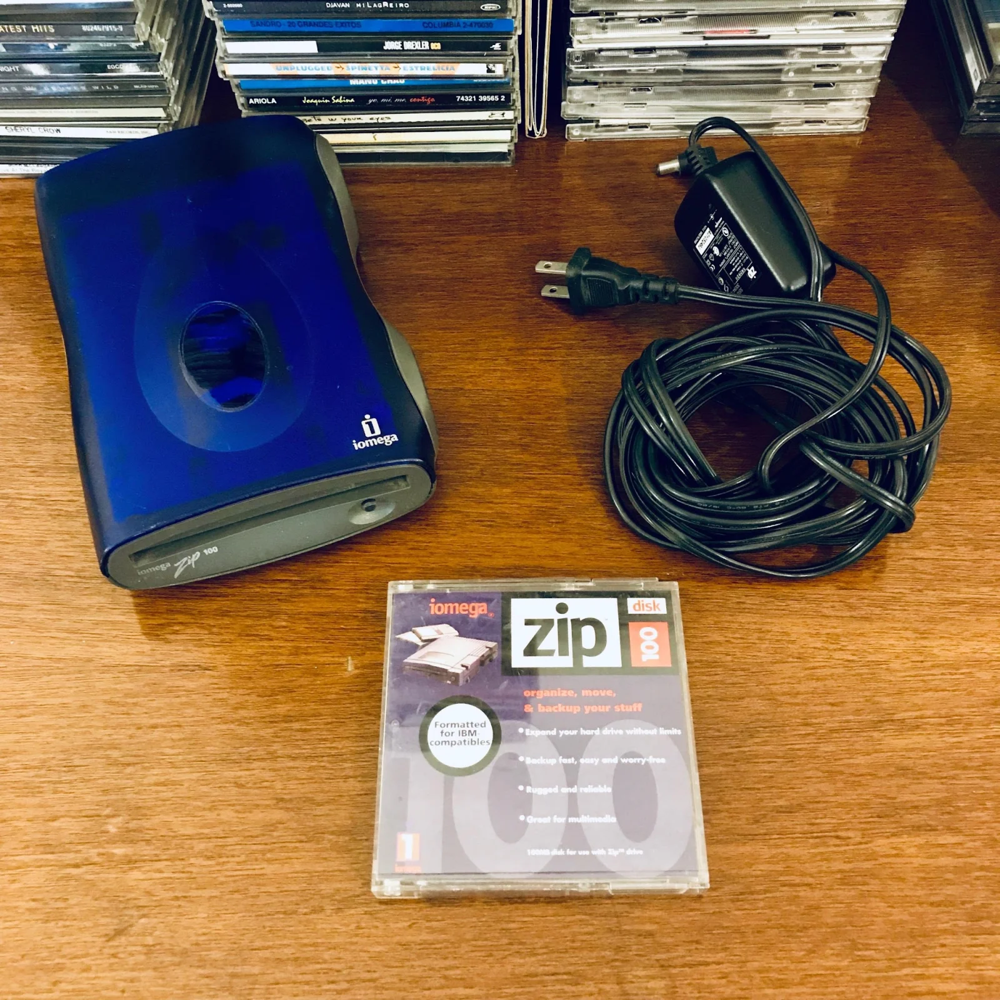
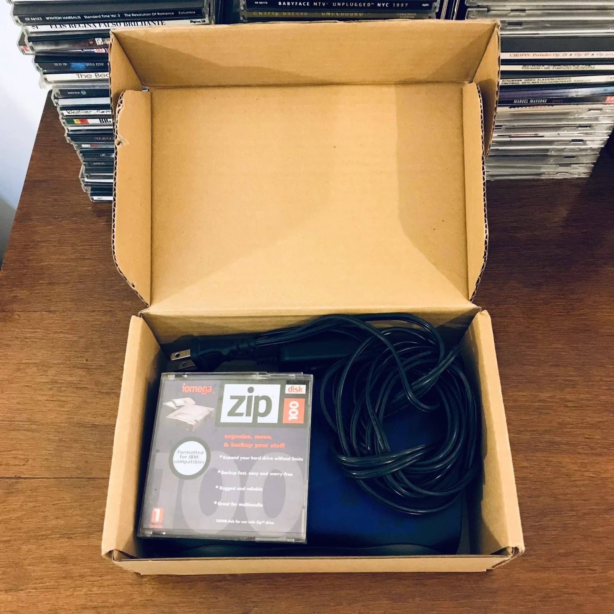

I was probably 19 or 20. I fixed PCs, installed home networks, programmed a little, and messed around with DIY projects while studying Electronics Engineering. Of course I went crazy when somebody showed up with a problem that didn't have an obvious answer.

I liked the jobs that didn't come with instructions. This was Argentina around 2000, and I thought being a hacker was cool. I wanted to make beige PCs do things nobody expected them to do.

One day, a client-of-a-client asked me to record every telephone call made from his house. All of them. Landline, analog, circa 2000. He said he suspected someone working there was stealing from him and wanted to know what happened while he was out.

I was basically a late teenager, and my reaction wasn't, "That sounds like a massive privacy problem." My reaction was, "Hell yeah. A cool challenge, and I was getting paid for it? LFG!"

*An early-2000s photograph of my bedroom phone, not the one in the client's house. I don't have a photograph of the line or the computer I worked on. Thank god I deleted all evidence ;)*

## Build a phone tap with I had lying around

If you wanted to make something weird around 2000, you usually had to make the weird thing. No Raspberry Pi, no cheap network storage, no cloud account to dump the recordings into. There was a family PC running Windows 95 or 98, a Sound Blaster, dial-up modems, some electronic junk, and freeware from the internet. I was full of confidence. Enough to be dangerous.

Almost every home computer then had one useful connection to the telephone network: the modem. That became my entry point.

## Computer lessons and a hidden job for the PC

The man had a daughter. I suggested putting a modem in the family computer so she could learn to use the internet.

I came over once a week and taught her basic computer stuff: Windows, websites, how to find things online. The lessons were real. So was the other reason I kept coming back.

**==I chose the family PC because it already had a reason to be on the phone line and could do the recording without looking like a recorder.==**

I installed what I remember as a U.S. Robotics voice modem, or something close to it. What mattered was that I could get telephone audio into the PC. I had a modem and a Sound Blaster. My question was whether I could make them talk to each other without leaving a recorder or a mess of wires next to the phone.

*Hardware reference, not my modem. Mine may have been ISA or PCI, and I can't verify its model. [Photo: Tremaster, adjusted by Pittigrilli](https://commons.wikimedia.org/wiki/File:Us_robotics_isa_modem-2011-04-11.jpg), [CC BY-SA 3.0](https://creativecommons.org/licenses/by-sa/3.0/); resized and converted to WebP.*

## The first recording was drenched in noise

This part is fuzzy after 25+ years. I remember the problem and the general path better than I remember the components.

I routed audio from the modem to the Sound Blaster's input. I wanted it all inside the computer. No external tape recorder. Nothing sitting next to the phone. Just a beige PC doing beige-PC things.

I remember an internal audio connection, but not which pins I used. The board below is a Sound Blaster 16 from the right era. Those sockets and pin headers along its upper edge are the kind of internal connections I'm talking about, not the little jumper switches that changed a card's settings.

*Hardware reference, not my sound card. I can't identify the exact board or connector I used. [Photo: Jekader](https://commons.wikimedia.org/wiki/File:CT2940_01.JPG), [CC BY-SA 3.0](https://creativecommons.org/licenses/by-sa/3.0/); resized and converted to WebP.*

The first attempt was a mess. Hum, noise, ground-loop garbage. So I dug through old parts and tried to clean up the audio. I remember a small transformer, probably salvaged from a dead radio or amplifier, and I think a capacitor was involved.

I'm not going to draw a circuit from memory and pretend it's a schematic. I can tell you what changed: the noise dropped, and the voices became clear enough to listen to.

At that point I knew the hardware side worked. I'd taken a dirty analog signal out of one card, cleaned it up with junk-drawer electronics, and got another card to record voices. For a minute I felt like a hacker, which was exactly who I wanted to be.

## Make it record the call, not the silence

Recording all day would have filled the disk. Somewhere on the prehistoric web I found a small Windows audio program that watched the Sound Blaster input and started saving audio when the level rose above a threshold. Those were the early days of the internet. That meant dial-up and download sites, one program at a time, until one did what I wanted. There was nobody to ask, and nothing to ask, either.

I might have used RecAll, or something similar that could hide itself from the system tray. When the line went quiet long enough, it stopped and saved the recording. Then it waited for the next call.

In 2000 it was ugly freeware. It did the job. I think the files were low-quality WAVs at a low sample rate and bit depth. Disk space wasn't free, and phone audio wasn't exactly hi-fi. There was no reason to fill a drive with silence at studio quality.

*The recorder's behavior as I remember it. The app name is a guess and the exact settings are gone.*

## The world's worst surveillance server, maybe?

The computer had to stay on. I changed the power settings so the monitor could go dark, but the PC couldn't go to sleep. A screensaver was fine. A sleeping PC missed the call. The one operating instruction was: "Don't turn off the computer."

That family PC now had a second job, running quietly in the background.

## Zip disks and weekly pickups

He was maybe in his sixties, and he wasn't going to browse folders, sort files by date, and manage a pile of recordings. He wanted to listen. ==I needed a way to get the recordings out that worked for him, not a workflow that made sense only to me.==

Enter the Iomega Zip 100 drive. A disk held 100 MB, which felt enormous until you started filling it with audio. I told him to buy the drive. It connected over USB.

Once a week I went to the house and taught his daughter. We sat at the computer and went through websites, Windows, whatever she wanted to learn. During those visits, I also moved the week's recordings onto a Zip disk and took it home.

Perfect sneaker-net.

*The actual drive I used, photographed years later with its power supply and a 100 MB disk. This one survived almost two decades in my possession.*

## The human end of the pipeline

Then he came to my house. I handed him headphones, and he sat at my computer for hours listening to the recordings, clicking through one after another and taking notes in a notebook.

That's the part the photograph at the top can't show. It was the same room and, later, that same chair. The picture has nobody in it. For a couple of months, somebody was.

This went on for maybe two or three months. The audio was clear. The program caught the calls without filling the disk with hours of silence. The computer stayed on. The Zip disks made the trip.

*The route as I remember it, not a recovered wiring diagram. Back then it was a PC left on, a disk in my bag, and a person at the other end.*

The system did exactly what I'd built it to do. I thought that was the whole answer.

Eventually he said he didn't need it anymore. I went back, removed the recording program, and cleared the files left on the family PC. I thought that was the end of the story.

## What he was really listening for

Some time later, the person who had referred him to me told me that the housekeeper had never been the real reason for the request. According to that person, he suspected his wife was having an affair. After weeks with the recordings, he believed he'd confirmed it.

That account came to me secondhand. I don't know what he actually heard, and I'm not going to fill in the missing parts of someone else's life.

Well. Fuck.

I'd accepted his explanation, built around it, and never asked the question that should have stopped the job before I opened a PC.

## The question I skipped

Would I build this for somebody today? Absolutely fucking not.

==I took one person's request as permission for everybody else's conversations. I had no basis for doing that.==

My brain basically did this:

> Can this be done?

Yes.

> Do I know how?

Not yet.

> Cool. Let's figure it out.

That was the complete risk assessment.

I can still recognize what interested me. A vague request became a set of problems I could work through: get audio into the PC, clean it up, start recording only when there was a call, keep the machine awake, move the files, make them usable by a person who didn't want to operate the system.

I didn't know the phrase solutions engineering yet. I knew I liked connecting pieces that weren't meant to be one system.

Back then it was computer parts and junk I found in drawers. I still like taking an awkward problem apart and getting a system to run. What changed is that "can I build it?" no longer gets to be the only question.

## The decisions, on the record

- **01 · Take the client's story at face value.** REVISED. I accepted his reason and didn't ask who else would be affected. That was the decision that mattered most.
- **02 · Use what I could get.** SETTLED as a build choice. A modem, a sound card, salvaged parts, and a small recording program were enough to make the machine work.
- **03 · Design the handoff for the person listening.** SETTLED as a build choice. A weekly disk and a chair with headphones worked better for him than expecting him to manage files.
- **04 · Test the whole route.** SETTLED as a build choice. A WAV file on disk wasn't the finish line. The client had to sit down, find the call, and hear it.

## The Zip drive's second life

I kept the Zip drive for almost twenty years. It followed me through moves and boxes of obsolete cables, dead hard drives, CD burners, MiniDiscs, and several rounds of "why am I still keeping this?"

Then I listed it on MercadoLibre. A buyer doing archival data recovery needed working Zip hardware to read old disks and paid me a surprisingly good price for it.

*The same drive boxed up for its MercadoLibre buyer, almost twenty years after the phone project. Its next job was recovering old archives.*

The drive ended up with a guy doing data recovery from older formats. Twenty years later it was still solving problems. Somehow, the Zip drive got the cleanest career trajectory in this story.

Someone shows up and says, "I have a weird problem," and something in my brain still answers, "I wonder if I can build a system for that."

Since then, my compliance department has improved considerably.
