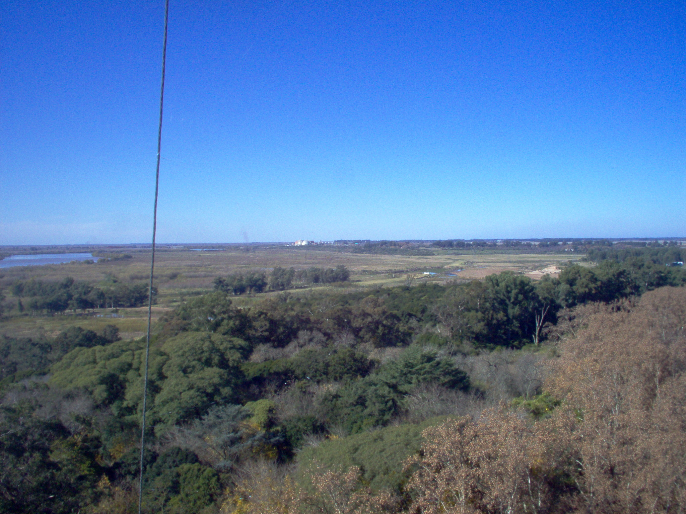
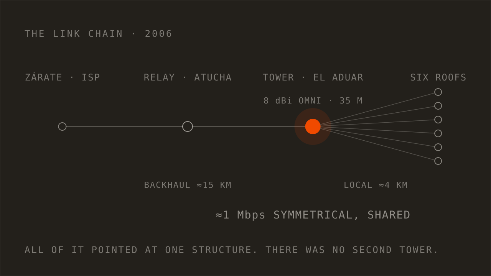
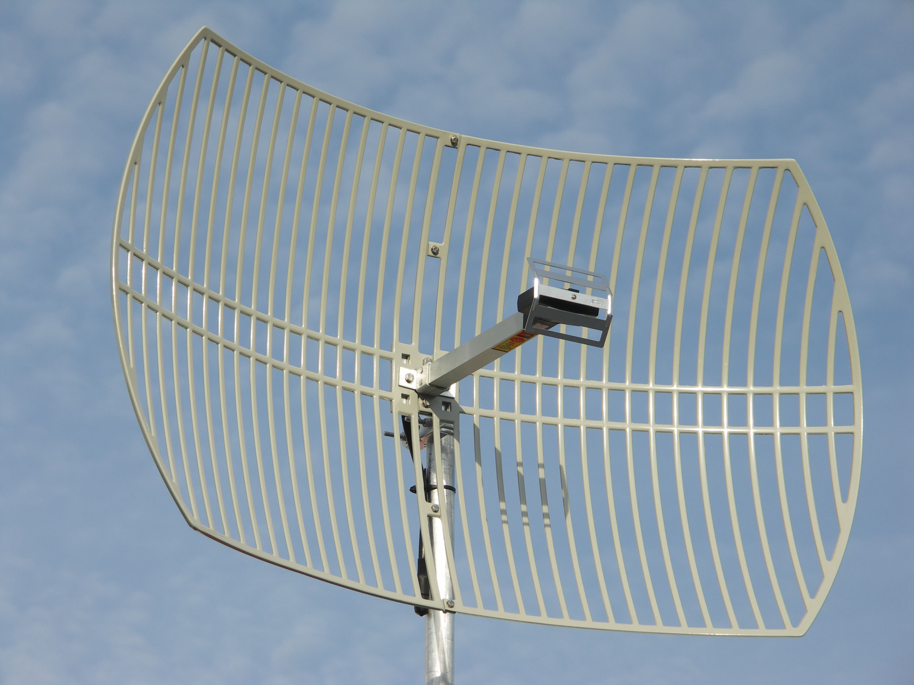

---
# --- Obsidian-internal (site ignores all of these) ---
type: work journal
created: 2026-08-09
project: "[[Rural Point]]"
people: []
aliases:
  - "LOG 013"
  - "THROWBACK 001"
  - "Rural Point"
  - "El Aduar wireless"

# --- web-* namespace (the ONLY fields the site reads) ---
web-status: published
web-title: "Rural Point: a wireless ISP in the Argentine countryside, 2006"
web-pub-date: 2026-08-09
web-snippet: "No 3G, no service, and the nearest connection 15 kilometers away. I climbed a 35-meter tower, proved the coverage from the front porches of the people who would pay for it, and ran a shared link for six families for three years. Then a storm took the tower down."
web-type: log
web-number: 13
web-stage: SHIPPED
web-tags: [WIRELESS, RF, NETWORKING, INFRASTRUCTURE]
web-series: THROWBACK
web-series-number: 1
web-thumb: "./assets/rural-point-2006-tower-AP-8dBi-omni-antena-its-me.webp"   # 16:9 crop of the summit photo
web-thumb-alt: "Me at the top of the tower in 2006, grinning at the camera, next to a weatherproof enclosure with a hazard label and the white 8 dBi omnidirectional antenna on its bracket, countryside and blue sky behind."
web-thumb-caption: "At the top, 2006. The white enclosure is the access point, the pole on the right is the 8 dBi omni that covered the property."
---

In 2006 there was no 3G, no 4G, and no way to get online where we lived. The
nearest connection was in Zárate, about 15 kilometers away across the Buenos
Aires countryside. So I climbed a 35-meter radio tower, bolted an access point
to the top of it, and spent a cold Saturday proving the signal reached the front
porches of the people who would end up paying for it. For the next three years,
six families out in the middle of nowhere checked their email and read the
newspaper over that link. Then a storm took the tower down.

It didn't have a name at the time. I'm calling it Rural Point now because it
needs a filename.

One honest note before anything else. This was twenty years ago and I'm working
from memory and a handful of photographs. The distances, the gain figures and
the dates are as accurate as I can make them, and where I'm not sure I say so.
**Nothing here is reconstructed to sound better than it was.**

## Nobody was going to sell us this

We were living in El Aduar, near Lima, in Buenos Aires Province. Real
countryside. The property was large and the houses on it were spread out over
several kilometers, which matters more than it sounds like it should.

There was no DSL and no cable, and there was never going to be. That's not a
complaint about the phone company, it's just arithmetic. Running a line out to a
handful of houses that far apart doesn't pay for itself, and no operator was
going to do it out of kindness. Mobile data existed in the way that a rumor
exists.

So the question stopped being "when does service get here" and became "what
would it actually take to build it." Those are very different questions. **The
first one you wait on. The second one has a parts list.**

## The expensive part was the connection, so I tested the cheap part first

Here's the shape of the risk. The internet connection itself was the expensive
piece: a monthly bill, a contract, radio hardware at both ends of a 15-kilometer
link, and a commitment I'd be stuck with. The local distribution around the
property was comparatively cheap.

**And the risk was sitting in exactly the wrong place.** If I bought the connection
first and then discovered the signal couldn't reach the far side of the
property, I'd own a bill and a very tall antenna and nothing anybody wanted.

So I inverted it. ==Build the local network first, with no internet on it at all.==
An empty network is enough to answer the only question that actually mattered:
does the signal get where the people are. If it did, I'd go buy the connection.
If it didn't, I'd have spent a fraction of the money finding out.

There was an old radio telephone tower on the property, around 35 meters, well
above the eucalyptus line. That was the whole reason any of this was possible.
The plan was an 8 dBi omnidirectional antenna at the top with an access point
next to it, radiating in every direction at once.


*The tower at El Aduar. Around 35 meters, guyed, and already old in 2006. It's the
only reason this worked, and eventually the only reason it stopped. The water tank
at the right is worth remembering for scale.*

## Thirty-five meters, and then you let go

Thirty-five meters sounds tall written down. I don't think I understood what it
meant until I was standing in it.

Everything looks different from above the tree line, and the thing nobody warns
you about is that the tower moves. Not dramatically. But you can feel the whole
structure swinging slowly with the wind, and your body has opinions about that
which your brain is not consulted on. It was my first time climbing anything
like it.

Then I got to the height I needed to work at, and I had to let go.

That's the moment I still remember most clearly. I had the harness around my
waist, but up to that point I'd been holding the tower with my hands, which is
what your hands want to do. Now I had to trust the harness, let go of the
structure, reach around into the backpack, and take out the access point.

I was scared and I was completely lit up at the same time. I had climbed
thirty-five meters with an access point in a backpack. The access point was
going in.

I spent about an hour up there. I mounted everything, tightened every screw I
could reach, used thread locker and doubled up the lock washers, and generally
behaved like someone who had thought carefully about what a Sudestada blowing in
off the Río Paraná does to hardware that was installed casually. That wasn't
craftsmanship for its own sake. It was arithmetic again. An hour with a wrench
at the top of the tower is cheap. Climbing it a second time because something
worked loose is not.

TAKEAWAY: when doing it twice is expensive enough, overbuild the first time. The
cost of the install is not the install, it's the repeat visit.

The strange part is that I don't remember being tired while I was up there. The
adrenaline handled that. What I remember is cold wind on my fingers, cold metal,
and the movement.


*Straight down from where I was working. Those two specks on the grass are people.
The circle near the top of the frame is that same water tank.*

Then everything was installed and it was time to come down, and my body finally
submitted its invoice. My legs started shaking as soon as I was on the ground
and I had to lie down. The noon sun was warm after an hour in that wind, and I
have rarely been so glad to be horizontal. I stayed there about twenty minutes
while my brother-in-law wandered over every so often to hand me a mate.

## The Imperial March test

Now I needed to know how far the signal actually went.

My brother-in-law had a white Ford Falcon. I still remember that car. It was a
cold Saturday around midday in August, and we went out to map the property with
an old HP laptop plugged into the 12-volt outlet, because laptop batteries in
2006 were decorative. The laptop had a terminal open, pinging the access point
on the tower continuously.

The antenna was a grid parabolic: a big open-frame dish about 60 by 45
centimeters, bolted to a length of wooden pole. A 24 dBi grid, and the same
model that would later end up at every subscriber's house, which is not a
coincidence. What matters about that number is the beamwidth: a dish
like that radiates in a cone of maybe seven to ten degrees. It does not spray.
You cannot wave it out of a car window and expect anything, because at that
beamwidth you are either pointed at the tower or you are pointed at a field.

So the survey was slow and deeply unglamorous. We crawled along gravel roads at
walking pace, stopped, got out, aimed the dish at where we thought the tower was
by hand, and watched the terminal. Then we got back in and did it again a few
hundred meters later.

Somewhere around three and a half or four kilometers out, the replies started
coming back.

That felt like the finish line for about ninety seconds, and then the
engineering part of my brain pointed out that a ping proves almost nothing. It
tells you one small packet survived the trip and came home. It doesn't tell you
the link will carry anything a person would actually want to do.

Which is why there was a computer at the bottom of the tower. It was a Pentium
II built from OEM parts, my own previous personal machine, and it was running
VLC with an MP3 of the Imperial March on a loop.

```terminal
$ ping 10.10.0.1
64 bytes from 10.10.0.1: icmp_seq=1 ttl=64 time=4.2 ms
64 bytes from 10.10.0.1: icmp_seq=2 ttl=64 time=3.9 ms
64 bytes from 10.10.0.1: icmp_seq=3 ttl=64 time=4.1 ms
$ vlc http://10.10.0.1:8080
```

*Reconstructed from memory, not a capture. In 2006 I was not screenshotting my
own terminal, which I now regret.*

I typed the address into VLC in the parked Falcon, hit enter, and the Imperial
March came blasting out of those terrible little laptop speakers, four
kilometers from the machine that was playing it.

That was the moment it stopped being an experiment. A ping tells you a packet
survived. **Darth Vader coming out of a laptop speaker in a parked car tells you
the link will carry whatever you decide to put on it.**

There was also something perfectly appropriate about the soundtrack. Every
square kilometer around that tower had just quietly become my little empire, and
it was traveling through the air.

TAKEAWAY: a reply is not a service. Test with the thing the user will actually
do, not with the thing that is easy to measure.

## The survey route was the sales route

Here's the part I didn't appreciate at the time.

We weren't only mapping radio coverage that Saturday. We were stopping at the
front porches of the neighbors who might want this. Every stop where the dish
found the tower was a stop at somebody's house, and I'd knock and explain what
we were doing and ask whether they'd be interested if it worked.

==By the end of the day I had two lists, and they were the same list.== Where the
signal reached, and who wanted it. Every confirmed link was also a confirmed
install site, with a person attached who had already said yes.

That turned out to matter enormously, because it's what made the money work. I
put up the cost of the backhaul with one neighbor, the two of us. Nobody else
spent anything until the link was live and they could see it running. Once it
was working, each family that joined paid for their own materials, the
directional antenna, the access point, the mount, the cable, plus my
installation fee. The monthly ISP bill got split across whoever was subscribed
at the time.

**Which means I de-risked the money exactly the way I'd de-risked the radio.** Prove
the cheap thing first, spend on the expensive thing second, and don't buy eight
households' worth of hardware for eight households that haven't agreed to
anything yet.

TAKEAWAY: the trip that proves your technology can be the same trip that proves
your demand. Most people run those separately, or skip the second one and find
out later.

## The chain: Zárate, a relay at Atucha, our tower, six roofs

With coverage proven, I went and bought the connection.

Even that wasn't a matter of calling an ISP and getting a cable. The provider
was in Zárate, but the signal didn't come to us directly from there. As I
remember it, they were already delivering connectivity to a Gendarmería Nacional
station at the Atucha nuclear complex, and our link was relayed on from there out
to the tower at El Aduar.



*The view along the backhaul, taken from the work position. The pale block on the
horizon is the Atucha complex. The directional antenna at the top of the tower
pointed at that, and the connection came back along the same line.*

So the full path looked like this:



*Redrawn for this post. Roughly 15 kilometers of backhaul into one tower, then
about 4 kilometers of local coverage out of it.*

The tower carried two jobs at once, which is the part worth drawing. At the top,
the 8 dBi omni and its access point covered the property. Also at the top, a
dish pointed back at the relay to bring the connection in. At the bottom, in a
box at ground level where I could reach it without a harness, a MikroTik router
did the actual routing between the two.

That split was deliberate. Anything that might need a firmware update, a reboot,
or a configuration change lived at the bottom of the tower. **Only the antennas
and the radios that had to be high were high.**


*Redrawn for this post. Everything serviceable is at ground level, which was the
only design decision made entirely out of respect for the climb.*

At each house, a 24 dBi grid dish pointed back at the tower. The same kind of
dish I'd been holding on a wooden pole during the survey, which is not a
coincidence: the survey rig was the product, tested in advance. Next to it, in a
weatherproof plastic box, sat a D-Link access point running custom firmware, and
the cable ran down into the house from there.

Where it went depended on the house. A roof, the water tank, a tall side wall.
Whichever had the cleanest line of sight back to the tower won, and that was the
only thing that decided it. Six to eight families, depending on the year.



*Custom-firmware D-Link access points behind aluminum grid parabolics like this
one, roughly 60 by 45 centimeters, mounted wherever the line of sight back to the
tower was cleanest. Not one of ours: I shot dozens of the real installs and
cannot find a single one today, which is its own small lesson about archives.*

The connection was about 1 Mbps symmetrical, shared across all of them.

By any standard you'd apply today that is a rounding error. It's worth being
honest about what it did and didn't do. It was not enough for video. It was not
enough for large downloads. It was enough to check your email, read the
newspaper, look something up, and send a message to somebody. Out there, that
wasn't a slow connection. It was the difference between nothing and something,
and nothing had been the only option available.

## Three years, then a Sudestada

==It ran for about three years, essentially nonstop.==

That's the number that counts. Not a weekend demo. Not a proof of concept
sitting on a bench with somebody watching it. Three years of being the thing a
handful of households in the
countryside relied on to reach the internet, in weather, without a support
contract or a spare parts budget or anybody to call.

Then a storm brought the tower down, which is about as definitive an ending as a
wireless network can get.

And here's the design flaw, stated plainly, because it's the most useful thing
in this entire post. Every house had its own antenna and its own access point.
The distribution was properly distributed. But all of it pointed at one
structure. There was no second tower, no fallback path, and no plan for one. **The
whole network had exactly one single point of failure, I knew it the entire
time, and after three years the weather went and found it.**

## The decisions, on the record

| DEC | Decision | Status |
|---|---|---|
| DEC 001 | Build the local network first and prove coverage before paying for any backhaul | SETTLED |
| DEC 002 | One 8 dBi omni at 35 meters rather than sectors: fewer parts up high, one climb | SETTLED |
| DEC 003 | Survey stopped and hand-aimed, not drive-by. A dish that narrow cannot be aimed from a moving car | SETTLED |
| DEC 004 | Run the survey to the porches of likely subscribers, so coverage and demand were proven on one trip | SETTLED |
| DEC 005 | Validate with real traffic, an audio stream, not with ICMP replies | SETTLED |
| DEC 006 | Two households fund the backhaul. Every later subscriber funds their own antenna, AP and install | SETTLED |
| DEC 007 | Split the monthly ISP bill across active subscribers | SETTLED |
| DEC 008 | Thread locker and doubled lock washers on everything up the tower: the second climb is the real cost | SETTLED |
| DEC 009 | Routing at ground level (MikroTik in a box at the base), radios only at the top. Nothing serviceable lives at 35 meters | SETTLED |
| DEC 010 | Accept a single point of failure at the tower, with no fallback path | REVISED |

DEC 010 is the one I got wrong, and I got it wrong knowingly. A second relay
point would have cost real money to serve a failure that hadn't happened yet, so
I didn't build one. Three years later the entire network ended in an afternoon.
I still think the call was defensible on the economics. **I no longer think it was
defensible to make it silently, without ever telling the people paying me that
their service hung on one guyed tower.**

## What carries over

I didn't know how to do any of this before I started. I wasn't a network
engineer. I learned the RF, bought or borrowed what I needed, tested things,
got things wrong, and kept going until it worked.

What I recognize now, looking back at it, isn't the radio knowledge. It's the
order of operations, and the order hasn't changed in twenty years:

Find the need nobody is being paid to serve. Identify which part is expensive
and which part is risky, and notice when they aren't the same part. Build the
cheapest possible test of the riskiest assumption. Prove it with real traffic
and real people, not with a metric that's convenient to collect. Then spend.

I run that same sequence now on automation projects and dashboards and AI
workflows, with better tools and much worse stories. The acronyms change every
few years. The sequence doesn't.

The thing I would do differently is DEC 010, and it generalizes further than radio.
**If everything you've built points at one component, you haven't built a system.
You've built a very good demonstration that happens to still be running.**

This is the first of these. I have twenty years of projects that were never
written down anywhere, and I'm going to work through the ones I can still find
the photographs for.
