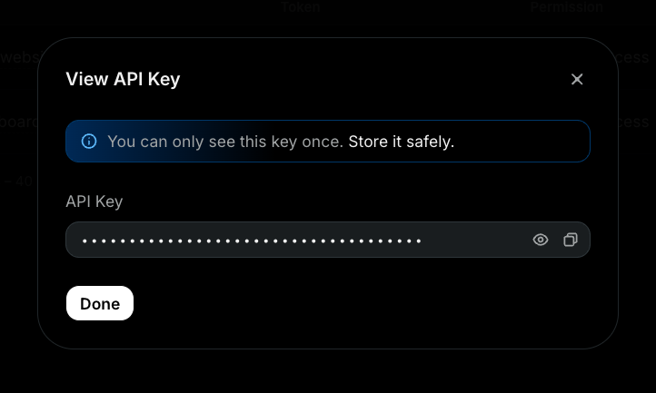
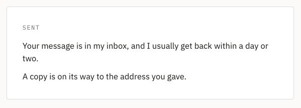
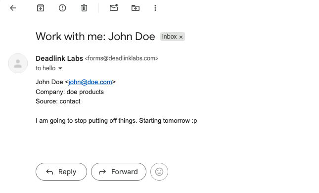

LOG 002 ended with an address that works. Anyone can write to
`hello@deadlinklabs.com` and it lands in my Gmail. That's the receiving half.

The About page still had a form that did nothing. You could fill it in and
press the button, and the button would look at you. This record is the sending
half: the form, the code behind it, the key, the tests, the deploy, and the
one bug I only found on the live site.

I built it in one sitting, on camera, with Claude Code doing the typing. Every
command is below, in the order it ran.

## One route runs. The rest stays files.

This site is static. The build turns every page into an HTML file, and Vercel
serves the files. Nothing runs. That's why it's fast, and that's why it can't
send email.

Astro's answer is an adapter. It teaches the build how to run code on Vercel,
and then a route can opt in to running. Only the route that asks. Every other
page stays a file.

```terminal
$ npm install @astrojs/vercel@^9 resend
$ npx astro sync
$ rm -rf dist && npm run build
```

The adapter went into `astro.config.mjs` with one other thing: a declaration
that the project expects a secret called `RESEND_API_KEY`, server side only.
Astro checks it when the code reads it, so a missing key fails loudly instead
of sending nothing.

There is no `output` line in that config. Astro's default is static, and the
adapter doesn't change it. It only makes running possible.

**One thing about the install:** I asked for the adapter version that matches
my Astro. The newest one on the registry is built for a newer Astro and refuses
to install on mine. If you're starting fresh today, yours just installs.


*Before the form. Eighteen pages, zero functions. The adapter is installed
and nothing asks for it yet.*

## The form is a function

I read Resend's Astro guide before writing anything, and it doesn't build an
API route. It uses an Astro Action: a function that lives on the server, and
the page calls it like a normal function. Astro validates the fields, sends
the request, and hands back `{ data, error }`. About fifteen lines in the
guide. Nothing to install.

Mine is longer, because it does four things:

1. **Checks four fields** with messages a person can read. "Please add your
   email so I can reply." Not "Expected string, received null."
2. **Sends me the message** from `forms@deadlinklabs.com` to `hello@`, with
   the visitor's address as Reply-To. Hit reply in Gmail and it goes to them.
   The subject is built from a hidden field saying which form it came from,
   so a second form on another page can reuse this one function.
3. **Checks Resend's answer.** Resend reports a rejected send in the response,
   it doesn't throw. Without that check a failed send looks exactly like a
   successful one, and the message is gone.
4. **Sends the visitor a receipt** from `hello@`, only after my copy went
   through. If the receipt fails, the form doesn't. My copy already landed,
   and telling the visitor "it failed" would be a lie.

Two things I did differently from the guide, on purpose. The key is read
through `astro:env/server`, not `import.meta.env`, because the second one
compiles the value into the build and I'd be shipping the secret. And the
email body is plain text, never HTML. A stranger types into that box.

The form on the page calls the action from a small script. Not through a form
`action=` attribute, because that would make the whole About page run on the
server. With the script, only the action runs. About stays a file.

```terminal
$ npx astro sync && npm run build
$ find .vercel/output/static -name index.html | wc -l
18
$ ls .vercel/output/functions
_render.func
```

Same eighteen pages. One function.

## The receipt only knows your name

The receipt email says thanks, says when I'll reply, and uses the name you
typed. Nothing else you typed goes into it.

==Anyone can type any address into a form, including someone else's.== If the
receipt quoted the message back, a spammer could write an ad, put a stranger's
address in the email box, and my site would deliver that ad, signed by
`hello@`. So the receipt knows your name and nothing else.

That's not spam protection. The form has none yet, and that's LOG 004, before
any search engine finds the page. This is the one safeguard I wasn't willing to
ship without.

## The key, and where it lives

The code was written and couldn't send anything, because it needs a key from
Resend. A key is a password that says this site is allowed to send from my
domain. So it goes nowhere near a file that could end up on GitHub.

In Resend: **API Keys**, **Create**. Name `dll-website`. Permission **Sending
access**, not full access, because the form only sends. Domain
**deadlinklabs.com**, not all domains. If the key ever leaks, the worst it can
do is send email from my own domain.



*Resend shows the key once. Password manager first, then the project.*

The project keeps it in a file called `.env`, one line, name on the left and
value on the right. Git has been told to pretend that file doesn't exist:

```terminal
$ printf 'RESEND_API_KEY=\n' > .env
$ git check-ignore -v .env
.gitignore:18:.env	.env
```

That line means "the rule on line 18 of `.gitignore` matches this file". Git
won't list it, won't stage it, won't push it.

**One finding worth writing down.** Before the key existed, the local site was
down. Every page, not only the form. In development Astro loads the actions
file on every request, the action asks for the key as it loads, the check
throws, and the About page shows an error called `ActionsCantBeLoaded`. On
Vercel only the function would fail. That's the reason the key goes into
Vercel before the push, not after.


*The site telling me plainly what it needs. This is the good kind of error.*

## The first send

Dev server up, form filled in, button pressed. No page reload. The form slides
out and a panel takes its place.



*The second line only shows when the receipt actually went out.*

And in Gmail:



*From `forms@`, so I can tell at a glance it came from the site. Reply goes to
the visitor.*

Then I made it fail on purpose. Same form, dev server started with a wrong key
for that one run, so Resend says no:

```terminal
$ RESEND_API_KEY=re_wrong npm run dev
```

The form showed the error under the button, with `hello@` in it as the way
out, and all four fields still held what I'd typed. Nothing was sent. That was
the whole point of the rebuild, and it held.

## The part a visitor feels

It worked. Now the part people notice. A typo in the email box got a grey
browser bubble and nothing else, and that's a form from 2005.

- **Messages as you type.** Leave a field and it checks itself, in the same
  words the server would use. The rules and every message live in one file
  that both the page and the action import, so there's one wording, whoever
  catches it. Fix the field and the message clears.
- **A count under the message box**, `0 / 4000`, and the box grows with what
  you write.
- **A spinner on the button** while it sends, and the sent panel fades in.
  Both are off if your system asks for reduced motion.
- **"Send another message"** in the sent panel. It resets the form and puts
  the cursor in the name field. ==That link is the only thing on the page that
  ever clears the fields.== Nothing else does. Not an error, not a failed
  send, not a reload.


*Caught before the button, in the same words the server would use.*

No framework, no island, no new colors. The page's own tokens, one script.

## Ship it

Three things, in this order: check the build, give the key to Vercel, push.

```terminal
$ rm -rf dist && npm run build
$ find .vercel/output/static -name index.html | wc -l
18
$ ls .vercel/output/functions | wc -l
1
```


*After the form. Same eighteen pages, plus one function. That's the whole
cost.*

The live site had never seen the key, because `.env` never leaves my laptop.
In Vercel: the project, **Settings**, **Environment Variables**, **Add**. Type
**Secret**, so nobody can read it back later. Key `RESEND_API_KEY`, the same
name as in `.env`, that's how the code finds it. Environments **Production**
and **Preview**. Save. It has to go in before the push, because a variable
only reaches the next build.


*Same name, same value, different machine.*

Then the commit and the push. On Vercel, the push is the deploy.

```terminal
$ git add package.json package-lock.json astro.config.mjs src/actions/index.ts src/lib/contact-rules.ts src/pages/about.astro
$ git commit
$ git push origin main
```


*The build on Vercel, same numbers as on my machine.*

## The bug only production could show

Live site, real form, real submit. Red text above the button: **Cross-site
POST form submissions are forbidden.**


*Localhost proved the wiring. Production proved the deploy. Different things.*

The form was fine. Astro has a security check that refuses form posts coming
from another website, and it decides by comparing the browser's origin with
the address the server thinks it has. On Vercel, the function doesn't see
`www.deadlinklabs.com` directly. It sees Vercel's internal host, plus a
forwarded header carrying the real one. Since a recent Astro release that
header is ignored unless you list the hosts you trust, so Astro rebuilt the
address from the internal host, compared it to the browser's, and refused
every submit as cross-site.

==The bug wasn't in the form. The server didn't know its own name.==

The fix is one block in `astro.config.mjs`, `security.allowedDomains`, listing
`https://www.deadlinklabs.com` and `https://deadlinklabs.com`. The check stays
on. Astro just knows which forwarded hosts are ours. One commit, one push, and
the live form sent both emails.

## Where this stands

Live. A real message went through `deadlinklabs.com/about` on September 16,
landed in Gmail with Reply-To on the visitor, and the visitor got the receipt.
A forced failure kept the fields. The site is still eighteen static pages and
one function.

Two things to know. Resend's free tier is 100 emails a day, and every
submission sends two, so that's 50 messages a day through the form. Fine for a
contact form; the receipt is the one to drop if it ever binds. And the form
has no spam protection. That's LOG 004, and it ships before the site opens to
search engines, never after.

**Done means a person can write once, press the button once, and get a real
answer. That passed.**

## Decisions on the record

- **01 · An adapter, and no `output` line.** Astro's default is static, and
  the adapter only makes running possible. One route asked.
- **02 · The page calls the action from a script.** A form `action=`
  attribute would make About run on the server. The script keeps it a file.
- **03 · The key is read at runtime, server side.** `astro:env/server`, never
  `import.meta.env`, which would compile the secret into the build.
- **04 · Email bodies are plain text.** A stranger's words never become
  markup in my inbox.
- **05 · The receipt knows your name and nothing else.** A form takes any
  address. A quoted message would let a stranger mail a stranger, signed by me.
- **06 · One file holds the rules and the messages.** The browser and the
  server say the same words because they read the same file.
- **07 · "Send another message" is the only thing that clears the form.** A
  portfolio site's form is the portfolio.
- **08 · List your own hosts, keep the check on.** The fix for the live bug
  was telling Astro who we are, not turning the security check off.

## Log timeline

- [[contact-form-and-domain-email]] (the receiving half, the address this
  form sends to)
- [[building-deadlinklabs-with-ai-in-public]] (the MVP both records follow)

TAKEAWAY: LOG 002 gave the site an address. LOG 003 gives a visitor a way to
use it without leaving the page, and gives me proof it worked.
