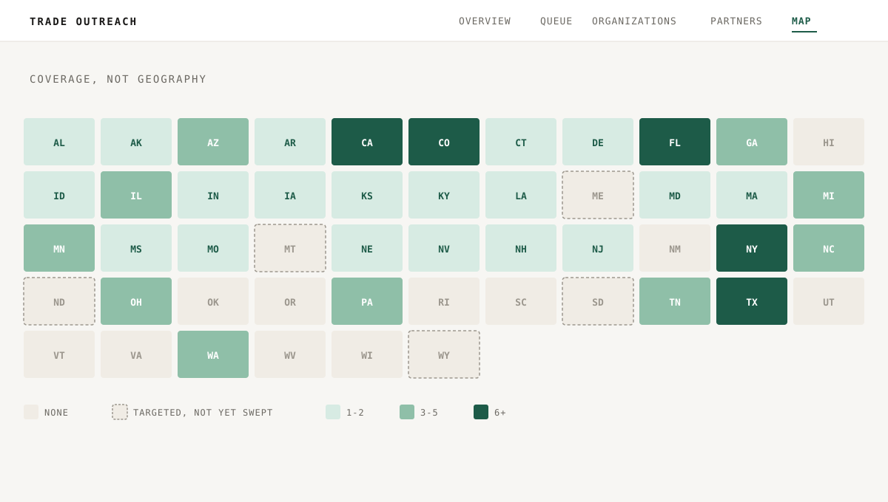

---
# --- Obsidian-internal (site ignores all of these) ---
type: work journal
created: 2026-08-19
project: "[[UO Outreach]]"
people: []
aliases:
  - "LOG 014"

# --- web-* namespace (the ONLY fields the site reads) ---
web-status: published
web-title: "They'd already done the research. They just couldn't tell who was worth writing to."
web-pub-date: 2026-08-19
web-snippet: "Dozens of prospects researched, then scattered across notes, bookmarks and an inbox. Two days of building with Claude Code turned it into a console that says who's worth an email this week."
web-type: log
web-number: 14
web-stage: SHIPPED
web-tags: [CLIENT-WORK, AI, AUTOMATION, DASHBOARDS]
web-thumb: "./assets/thumb.webp"   # built from the post's own coverage grid; source at assets/thumb.svg
web-thumb-alt: "Cover reading TRADE OUTREACH, coverage not geography, above the console's schematic grid of state tiles shaded from pale to dark green by how many organizations are tracked in each, with dashed outlines on the states targeted but not yet worked through."
---

They had already done the research. That was the part that surprised me.

A small tourism operator wanted a referral network: other businesses that
already send customers off on trips, who could start sending a few their way.
They'd looked into dozens of them. Who ran what, who took groups abroad, who
might actually be a fit. The research was real and it was good.

It just lived everywhere. Some in notes, some in bookmarks, a few promising
threads sitting in an inbox. So every time they sat down to write to someone,
they started by trying to remember what they already knew. Nothing was
missing. Nothing was findable either.

```terminal
$ node scripts/build-queue.mjs
reading org notes... done
ranking by signal age... done
QUEUE.md rewritten, stale signals dropped to the background list
```

## The bill was never the process. It was the fix.

You probably know exactly which part of your week is being eaten. Most people
do. You've maybe known for a year.

What you don't have is a reason to believe that fixing it costs less than
living with it. A proper custom build has a price tag and a timeline that only
make sense for a much bigger problem, so anything costing you a few hours a
week never clears the bar. The workaround becomes permanent. After a while it
stops looking like a workaround and starts looking like the job.

## Why I could say yes to a problem this small

I design and ship this kind of thing myself, directly, with Claude Code, an AI
coding tool, instead of running a dev team or booking a multi-month engagement.
Here's what that actually looked like on this one.

Monday we sat down and I asked how the work happens now. Where the research
lives. What they do when they want to write to somebody. What makes one
business worth contacting before another one. That conversation is the part
that matters, and it's the part nobody gets to skip.

Tuesday and Wednesday I built it. ==The record format, the queue and the
console went in inside two days, which is the whole argument: once the code
stops being the expensive part, the expensive part becomes understanding what's
actually eating someone's time.== Thursday he sat down in front of it and told
me what I got wrong. By the following Monday it was running on his side and he
was working out of it.

That's the shape of it. Not a scoping call, a proposal, and a quarter of
waiting. A conversation on Monday, working software the Monday after.

Here, the thing that was genuinely annoying was the not-knowing. So that's
what I built for.

## The obvious fix would have been the wrong one

The obvious move is a CRM. But a CRM assumes you already have the accounts, and
a mail tool assumes you already know who to write to and want to send faster.
Neither one touches the actual problem, which is working out which of these
businesses is worth your attention *today*.

So what's underneath is almost aggressively plain. Every organization is a
markdown file: contact details, a paragraph on why they're worth writing to,
and a log of every touch and every reply. There's no database. Every change to
that data is a reviewable diff, the same way a code change is, because a
mistake in a prospect list is a mistake in somebody's inbox. I wanted every
edit inspectable before it happened, not after.

**The whole thing runs on Node, one dependency, and a plain config file for the
rules that actually matter**: how many emails go out a day, how long before a
follow-up, how long a signal stays warm. Boring, on purpose. Something that
decides who gets a cold email needs to be auditable more than it needs to be
clever.

TAKEAWAY: the fastest way to lose trust in a system like this is a black box
making the call. Plain files and a git log are slower to build and much easier
to defend.

## The hard part was never sending the email

Most of what you research is quiet. A business exists, runs the right kind of
trips, and has been doing it the same way for years. That's not worth an email
today.

What's worth an email is a business doing something right now. Announcing a
trip, opening a season, selling out a departure. The console's whole job is
noticing that, and then forgetting it again once it goes stale.

So every organization can carry a signal: something time-stamped that says
this is the week to write, not next month. A signal decays. After a set window
it drops out of the ranking on its own and the prospect falls back to a
background list, instead of sitting at the top of a queue nobody rechecks
anymore. **The queue is never edited by hand.** It gets rebuilt from the org
files every time, so the order always reflects what's true today, not who
sorted it last.


*Recreated for this post. The layout and the tiering logic are real; the
organization names, tags and counts are placeholders.*

TAKEAWAY: prioritizing isn't a bigger list with more columns. It's a decay
function and a rule for what falls off the top.

## What fifteen minutes a day actually needs

The console opens on one screen: how many prospects are ready to write to
today, how many follow-ups are owed, how many partners exist so far, how many
areas are covered, and a funnel running from first research through to an
active partner. ==A dashboard nobody opens is worse than no dashboard, so the
whole screen answers one question at a glance: is there something to do today,
and how much of it.==

Under the stat tiles sits a program-coverage table, which exists for a duller
reason than the funnel. It's the thing that tells you where the research is
getting thin, before that becomes a gap you notice by accident six months from
now.


*Recreated for this post. The layout is real; the figures are illustrative,
not the client's actual numbers.*

## A map that isn't a map



*Recreated for this post. The grid layout is real; the shading is illustrative.*

A literal map with pins pulls your eye to geography, and geography wasn't the
question. **A map answers "where." A coverage grid answers "how much is left to
cover."** So the map screen isn't a projection at all. It's a grid, one tile
per state, shaded by how many organizations are on file there, with a dashed
outline where somewhere has been targeted but not yet worked through.

It reads slower than a real map for about three seconds. Then it reads faster
every session after that, because what you're actually asking it is a coverage
question.

## Nothing gets deleted, especially a "no"

**A suppressed contact stays suppressed, and every send checks that list
first**, so opting out actually works rather than just feeling like it did on
the day someone asked. The list is append-only. Nothing comes off it by hand.

Rejections stay too, for a different reason. A "no" gets filed with a category
rather than deleted, because the reason behind it can change. Ownership turns
over, a policy relaxes, a competitor relationship ends. Six months from now,
a rejected file with its history intact is worth more than a tidy list that
threw it away.

## Your inbox already knows all of this

The newest piece, and it was designed in rather than bolted on. The console
watches a dedicated mail folder, threads every reply against the right
organization, and reads each thread for a status change: a reply moves someone
from "written to" to "replied," real interest moves them to "interested," a
request for the partner kit moves them to "kit sent."

**Detection handles the clear cases and leaves the ambiguous ones for a person
to confirm**, rather than guessing and writing a wrong status into the record.
Automate the pattern, never the exception to it.

Nobody retypes "they replied" into a second system, or updates a status by hand
after reading the same email twice. Your inbox already holds that. The console
reads it, using the same status vocabulary that drives the funnel and the queue
tiers.

Zoomed in on one organization, the whole logic looks like this:

![A vertical logic flowchart: research, signal found, queued and email sent run straight down the middle, each writing into the same org.md file, shown as two mock snapshots on the right, one after research (org, area, programs, why) and one after the first email (status, signal, last touch, thread, next step). A "replied?" decision loops back to queued on no, or continues to "thread read" and "interested?" on yes, which either branches off to a dashed-outline "rejected, filed and kept" box or continues to "kit sent" and a dashed, not-yet-built "referral logged?" step, ending on the orange "partner" node.](./assets/logic.svg)

*Mock data throughout. The shape of the logic and the record's fields are
real; the organization, the numbers and the thread ID are placeholders.*

## It shipped. Then he told me what was wrong with it.

It runs on his side now. The research that used to live in four places lives in
one, and the question that used to start with twenty minutes of remembering
takes about as long as reading a list.

The part I care about more came after. He used it against his own prospects and
came back with the things I had gotten wrong, which is the round that actually
makes it his. Software nobody has argued with yet isn't finished. It's just
untested.

Today the console and their existing booking system agree on exactly one
thing: a referral code. That was deliberate. A prospecting tool that also tries
to be the booking system turns into two mediocre tools instead of one good one,
so I kept them apart rather than build a second system of record before there
was anything worth keeping in sync.

==That boundary is exactly where the next piece of work lives: closing the loop
so a partner's referral shows up on the booking side by itself, instead of
somebody retyping a code.== It's a small integration and an obvious one, which
is usually a sign the two systems were scoped right the first time.

## The decisions, on the record

| DEC | Decision | Status |
|---|---|---|
| DEC 001 | Design and build it directly with Claude Code, not a dev team or a multi-month engagement | SETTLED |
| DEC 002 | Plain markdown files and git diffs over a database, so every prospect-list change is inspectable | SETTLED |
| DEC 003 | No sending automation. A person writes and sends every email | SETTLED |
| DEC 004 | Priority is driven by decaying signals, not a static list order | SETTLED |
| DEC 005 | A schematic coverage grid instead of a literal map | SETTLED |
| DEC 006 | Suppression checked before every send; rejections kept on file, never deleted | SETTLED |
| DEC 007 | A hard daily send cap, enforced by the tool rather than by discipline alone | SETTLED |
| DEC 008 | Mail-thread status read from the inbox instead of hand-entered | TESTING |
| DEC 009 | Status detection handles the clear cases; ambiguous threads wait for a person | SETTLED |
| DEC 010 | Keep the console and the booking system separate until there's something to synchronize | SETTLED |
| DEC 011 | Close the referral-code loop between the two systems | RESEARCH |

## What carries over

None of this is really about referral partners.

Any time the hard part is deciding who's worth your limited attention today,
out of a list that keeps growing, the shape is the same: track a signal, let it
decay, and let the ranking rebuild itself instead of asking a person to re-sort
a spreadsheet from memory.

And the smaller lesson: build the boring, auditable version first. A markdown
file and a git diff won't impress anyone in a demo, but they're why this can be
handed over, or extended, without anyone having to trust a black box got it
right.

The thing I keep coming back to is that none of it would have been worth
building at this size if building it still cost what it used to. That's the
actual shift. Not that the tool is clever. That a problem this small was ever
worth fixing at all.

**The best outreach tool isn't the one that writes the email. It's the one that
tells you which ones, out of everything you could write today, are worth your
next fifteen minutes.**
